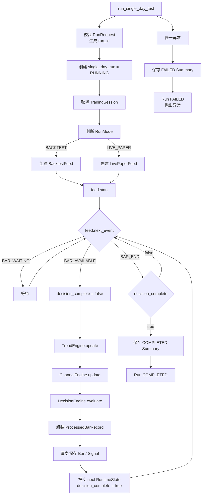
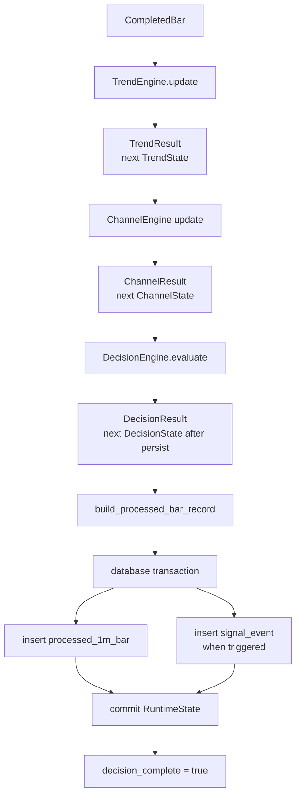

# IBAPI 单日虚拟测试开发设计

项目：intraday_channel_engine  
文档类型：面向代码落地的模块与函数设计  
项目定位：全新项目  
业务来源：`ibapi_single_day_test_flow_design.md` 当前有效版本  
范围：单日、单标的、单 Parameter Set、单方向、单初始阈值

---

## 1. 开发目标

实现一个可同时支持：

```text
BACKTEST
LIVE_PAPER
```

的单日测试程序。

两种模式共享：

```text
Trend 算法
Channel 算法
Decision 算法
完整 Bar 保存
运行总结
异常处理
```

两种模式只在以下部分不同：

```text
交易日与 RTH 数据取得方式
1-minute Bar 的准备方式
运行结束条件
```

当前项目不包含：

```text
真实订单提交
Paper 订单提交
中断恢复
状态重放
checkpoint
多标的并行
多日期批量调度
```

---

## 2. 总体架构原则

### 2.1 分层

```text
Application
    单日运行编排

Domain
    数据模型、枚举、状态对象、异常

Core Engine
    Trend、Channel、Decision 纯算法

Bar Feed
    Backtest 与 Live Paper 的 Bar 准备

Infrastructure
    IBAPI、数据库、时间、日志

Persistence
    原始 Bar、完整 Bar、Run、Signal、Summary 保存
```

### 2.2 核心约束

1. Core Engine 不直接调用 IBAPI；
2. Core Engine 不直接访问数据库；
3. Core Engine 不读取系统时间；
4. Trend、Channel、Decision 只接收显式输入；
5. Backtest 与 Live Paper 最终都输出统一的 `CompletedBar`；
6. 每根 Bar 必须完成计算并保存成功后，才能处理下一根；
7. 运行时状态只在本进程内维护；
8. 任何异常立即终止当前 `run_id`。

---

## 3. 推荐项目目录

```text
project_root/
├─ pyproject.toml
├─ README.md
├─ config/
│  └─ parameter_sets.csv
├─ src/
│  └─ single_day_test/
│     ├─ __init__.py
│     ├─ main.py
│     │
│     ├─ application/
│     │  ├─ single_day_runner.py
│     │  ├─ run_context_factory.py
│     │  ├─ bar_processor.py
│     │  └─ summary_service.py
│     │
│     ├─ domain/
│     │  ├─ enums.py
│     │  ├─ models.py
│     │  ├─ states.py
│     │  ├─ parameters.py
│     │  ├─ transitions.py
│     │  └─ errors.py
│     │
│     ├─ engine/
│     │  ├─ regression.py
│     │  ├─ trend_engine.py
│     │  ├─ channel_engine.py
│     │  └─ decision_engine.py
│     │
│     ├─ bar_feed/
│     │  ├─ base.py
│     │  ├─ completed_bar_queue.py
│     │  ├─ backtest_feed.py
│     │  ├─ live_paper_feed.py
│     │  └─ bar_validation.py
│     │
│     ├─ ib/
│     │  ├─ gateway.py
│     │  ├─ callback_bridge.py
│     │  ├─ historical_service.py
│     │  ├─ live_bar_service.py
│     │  └─ trading_session_service.py
│     │
│     ├─ persistence/
│     │  ├─ database.py
│     │  ├─ trade_date_repository.py
│     │  ├─ raw_bar_repository.py
│     │  ├─ run_repository.py
│     │  ├─ processed_bar_repository.py
│     │  ├─ signal_repository.py
│     │  └─ summary_repository.py
│     │
│     └─ support/
│        ├─ clock.py
│        ├─ ids.py
│        └─ logging.py
│
└─ tests/
   ├─ unit/
   │  ├─ test_trend_engine.py
   │  ├─ test_channel_engine.py
   │  ├─ test_decision_engine.py
   │  ├─ test_bar_validation.py
   │  └─ test_mode_resolution.py
   ├─ integration/
   │  ├─ test_backtest_feed.py
   │  ├─ test_live_paper_feed.py
   │  └─ test_persistence.py
   └─ e2e/
      ├─ test_single_day_backtest.py
      └─ test_single_day_live_simulated.py
```

---

## 4. 顶层运行入口

### 4.1 输入模型

```python
@dataclass(frozen=True)
class RunRequest:
    symbol: str
    trade_date: date
    parameter_set: ParameterSet
    direction: Direction
    initial_threshold: float
```

### 4.2 入口函数

```python
def run_single_day_test(
    request: RunRequest,
    dependencies: ApplicationDependencies,
) -> RunSummary:
    ...
```

### 4.3 入口职责

```text
1. 校验输入
2. 生成 run_id
3. 创建 Run 记录
4. 取得交易日与 RTH
5. 判断 BACKTEST / LIVE_PAPER
6. 创建对应 BarFeed
7. 初始化 RuntimeState
8. 循环读取并处理 Bar
9. 保存 COMPLETED Summary
10. 返回 RunSummary
```

异常时：

```text
1. 记录错误
2. 将 Run 标记为 FAILED
3. 保存 FAILED Summary
4. 重新抛出异常
```

---

## 5. 领域枚举

```python
class Direction(str, Enum):
    BUY = "BUY"
    SELL = "SELL"


class RunMode(str, Enum):
    BACKTEST = "BACKTEST"
    LIVE_PAPER = "LIVE_PAPER"


class LivePhase(str, Enum):
    PRE_MARKET_WAIT = "PRE_MARKET_WAIT"
    IN_SESSION = "IN_SESSION"


class BarSource(str, Enum):
    HIST = "HIST"
    LIVE = "LIVE"


class FeedStatus(str, Enum):
    BAR_AVAILABLE = "bar_available"
    BAR_WAITING = "bar_waiting"
    BAR_END = "bar_end"


class TrendLabel(str, Enum):
    UP = "UP"
    DOWN = "DOWN"
    SIDEWAY = "SIDEWAY"


class DecisionLabel(str, Enum):
    BUY = "BUY"
    NO_BUY = "NO_BUY"
    SELL = "SELL"
    NO_SELL = "NO_SELL"


class RunStatus(str, Enum):
    RUNNING = "RUNNING"
    COMPLETED = "COMPLETED"
    FAILED = "FAILED"
```

`raw_trend` 和 `effective_trend` 允许为 `None`。

---

## 6. Parameter Set

```python
@dataclass(frozen=True)
class ParameterSet:
    parameter_set_id: str

    trend_window: int
    slope_std_window: int
    dev_window: int
    residual_window: int

    r2_threshold: float

    channel_high_percentile: float
    channel_low_percentile: float

    continuous_break_count: int
```

### 6.1 当前参数用途

| 参数 | 当前用途 |
| --- | --- |
| `trend_window` | `trend_stack` 最大长度与 Trend 回归窗口 |
| `slope_std_window` | 非空 slope 的标准差窗口 |
| `r2_threshold` | Trend 拟合是否有效 |
| `channel_high_percentile` | Channel high deviation 百分位，范围 0–100 |
| `channel_low_percentile` | Channel low deviation 百分位，范围 0–100 |
| `continuous_break_count` | 连续突破触发次数 |
| `dev_window` | 当前算法保留参数，暂不参与计算 |
| `residual_window` | 当前算法保留参数，暂不参与计算 |

### 6.2 参数校验

```python
def validate_parameter_set(params: ParameterSet) -> None:
    assert params.trend_window >= 3
    assert params.slope_std_window >= 2
    assert 0.0 <= params.r2_threshold <= 1.0
    assert 0.0 <= params.channel_high_percentile <= 100.0
    assert 0.0 <= params.channel_low_percentile <= 100.0
    assert params.continuous_break_count >= 1
```

---

## 7. 核心数据模型

### 7.1 原始 Bar

```python
@dataclass(frozen=True)
class RawBar:
    symbol: str
    timestamp_et: datetime
    open: float
    high: float
    low: float
    close: float
    volume: float
```

约束：

```text
timestamp_et = 当前分钟开始时间
所有时间必须为 America/New_York aware datetime
```

### 7.2 Completed Bar

```python
@dataclass(frozen=True)
class CompletedBar:
    raw: RawBar
    source: BarSource
```

只允许已经结束、不再更新的 1-minute Bar 进入 Core Pipeline。

### 7.3 Trend 输出

```python
@dataclass(frozen=True)
class TrendResult:
    price: float

    slope: float | None
    r2: float | None
    slope_rmse: float | None
    slope_std: float | None
    trend_fit_ok: bool | None
    raw_trend: TrendLabel | None

    trend_stack_length_after: int
```

### 7.4 Channel 输出

```python
@dataclass(frozen=True)
class ChannelResult:
    pred_high: float | None
    pred_low: float | None

    effective_trend: TrendLabel | None

    last_trend_slope: float | None
    last_trend_intercept: float | None
    last_trend_bar_count: int | None
    last_high_percentile: float | None
    last_low_percentile: float | None

    curr_trend_slope: float | None
    curr_trend_intercept: float | None
    curr_high_percentile: float | None
    curr_low_percentile: float | None

    channel_stack_length_after: int
```

### 7.5 Decision 输出

```python
@dataclass(frozen=True)
class DecisionResult:
    decision: DecisionLabel
    recorded_break_count: int
    triggered: bool
```

`recorded_break_count` 是写入当前完整 Bar 的值。

### 7.6 完整结果 Bar

```python
@dataclass(frozen=True)
class ProcessedBarRecord:
    run_id: str
    symbol: str
    trade_date: date
    timestamp_et: datetime

    mode: RunMode
    bar_source: BarSource
    direction: Direction

    parameter_set_id: str
    parameter_snapshot: dict

    initial_threshold: float
    active_threshold: float

    open: float
    high: float
    low: float
    close: float
    volume: float

    trend: TrendResult
    channel: ChannelResult
    decision: DecisionResult
```

---

## 8. 运行时状态

### 8.1 总状态

```python
@dataclass
class RuntimeState:
    trend: TrendState
    channel: ChannelState
    decision: DecisionState

    decision_complete: bool
    processed_bar_count: int
    signal_events: list[SignalEvent]
```

初始化：

```python
RuntimeState(
    trend=TrendState.empty(),
    channel=ChannelState.empty(),
    decision=DecisionState(break_count=0),
    decision_complete=True,
    processed_bar_count=0,
    signal_events=[],
)
```

### 8.2 TrendState

```python
@dataclass
class TrendState:
    bars: deque[TrendBar]
    valid_slopes: deque[float]
```

约束：

```text
bars.maxlen = trend_window
valid_slopes.maxlen = slope_std_window
```

### 8.3 ChannelState

```python
@dataclass
class ChannelState:
    bars: list[ChannelBar]
    effective_trend: TrendLabel | None

    last_trend_slope: float | None
    last_trend_intercept: float | None
    last_trend_bar_count: int | None
    last_high_percentile: float | None
    last_low_percentile: float | None

    curr_trend_slope: float | None
    curr_trend_intercept: float | None
    curr_high_percentile: float | None
    curr_low_percentile: float | None
```

`channel_stack` 当前不限制长度，因此使用普通 `list`。

### 8.4 DecisionState

```python
@dataclass
class DecisionState:
    break_count: int
```

---

## 9. 交易日与模式模块

文件：

```text
application/run_context_factory.py
ib/trading_session_service.py
persistence/trade_date_repository.py
support/clock.py
```

### 9.1 交易时段模型

```python
@dataclass(frozen=True)
class TradingSession:
    trade_date: date
    is_trading_day: bool
    session_start_et: datetime | None
    session_end_et: datetime | None
```

### 9.2 交易日取得

```python
def get_or_fetch_trading_session(
    trade_date: date,
    repository: TradeDateRepository,
    ib_gateway: IbGateway,
) -> TradingSession:
    ...
```

流程：

```text
查询本地 trade_date
    有记录 -> 返回

没有记录
    -> 通过 IBAPI 查询
    -> 保存本地
    -> 返回
```

非交易日：

```python
raise NonTradingDayError(trade_date)
```

### 9.3 模式判断

```python
@dataclass(frozen=True)
class ModeResolution:
    mode: RunMode
    live_phase: LivePhase | None
```

```python
def resolve_run_mode(
    trade_date: date,
    current_datetime_et: datetime,
    session: TradingSession,
) -> ModeResolution:
    ...
```

规则：

```text
trade_date < current ET date
    BACKTEST

trade_date > current ET date
    InvalidTradeDateError

trade_date == current ET date
    current < session_start
        LIVE_PAPER / PRE_MARKET_WAIT

    session_start <= current <= session_end
        LIVE_PAPER / IN_SESSION

    current > session_end
        BACKTEST
```

---

## 10. BarFeed 接口

### 10.1 统一接口

```python
@dataclass(frozen=True)
class FeedEvent:
    status: FeedStatus
    bar: CompletedBar | None
```

```python
class BarFeed(Protocol):
    def start(self) -> None:
        ...

    def next_event(self) -> FeedEvent:
        ...

    def close(self) -> None:
        ...
```

约束：

```text
BAR_AVAILABLE -> bar 必须非空
BAR_WAITING   -> bar 必须为空
BAR_END       -> bar 必须为空
```

### 10.2 CompletedBarQueue

```python
class CompletedBarQueue:
    def put(self, bar: CompletedBar) -> None:
        ...

    def get_nowait(self) -> CompletedBar:
        ...

    def empty(self) -> bool:
        ...
```

Queue 内只允许：

```text
已完成 Bar
timestamp_et 唯一
按 timestamp_et 递增消费
```

---

## 11. BacktestFeed

文件：

```text
bar_feed/backtest_feed.py
bar_feed/bar_validation.py
persistence/raw_bar_repository.py
ib/historical_service.py
```

### 11.1 构造函数

```python
class BacktestFeed:
    def __init__(
        self,
        symbol: str,
        session: TradingSession,
        raw_bar_repository: RawBarRepository,
        historical_service: HistoricalBarService,
    ) -> None:
        ...
```

### 11.2 启动流程

```python
def start(self) -> None:
    local_bars = raw_bar_repository.load_rth_bars(
        symbol=self.symbol,
        trade_date=self.session.trade_date,
    )

    if validate_complete_backtest_day(local_bars, self.session):
        selected_bars = local_bars
    else:
        downloaded_bars = historical_service.fetch_complete_rth_day(...)
        validate_complete_backtest_day_or_raise(
            downloaded_bars,
            self.session,
        )
        raw_bar_repository.upsert_many(downloaded_bars)
        selected_bars = downloaded_bars

    enqueue_as_hist(selected_bars)
    self._producer_finished = True
```

### 11.3 完整性检查

```python
def validate_complete_backtest_day(
    bars: Sequence[RawBar],
    session: TradingSession,
) -> bool:
    ...
```

必须检查：

```text
timestamp 唯一
timestamp 严格递增
每个预期 RTH 分钟存在
不存在 RTH 外 Bar
数量等于 expected_bar_count
每根 Bar 数值合法
```

### 11.4 数值检查

```python
def validate_raw_bar(bar: RawBar) -> None:
    ...
```

规则：

```text
OHLC 非空
volume 非空且 >= 0
OHLC > 0
high >= open
high >= close
high >= low
low <= open
low <= close
```

### 11.5 输出状态

```text
Queue 非空
    BAR_AVAILABLE

Queue 为空且 producer_finished = true
    BAR_END
```

BacktestFeed 不输出长期 `BAR_WAITING`。

---

## 12. LivePaperFeed

文件：

```text
bar_feed/live_paper_feed.py
ib/historical_service.py
ib/live_bar_service.py
ib/callback_bridge.py
```

### 12.1 Live 内部状态

```python
@dataclass
class LiveFeedState:
    initialization_complete: bool
    historical_complete: bool
    subscription_active: bool
    last_expected_bar_received: bool

    live_buffer: dict[datetime, RawBar]
    queued_timestamps: set[datetime]
```

### 12.2 盘前启动

```text
等待 session_start_et
启动实时订阅
initialization_complete = true
之后完成的 Bar 标记 LIVE
```

### 12.3 盘中启动

启动顺序：

```text
1. 先启动实时订阅
2. 请求当日已完成历史 Bar
3. 历史请求完成前，已完成实时 Bar 写入 live_buffer
4. 历史完成后合并 historical + live_buffer
5. timestamp 去重
6. timestamp 升序
7. 全部标记 HIST
8. 放入 CompletedBarQueue
9. 清空 live_buffer
10. initialization_complete = true
11. 之后的新完整 Bar 标记 LIVE
```

Live Paper 不执行 Backtest 的完整日检查，也不要求未来分钟已经存在。

### 12.4 Live Bar 完成

```python
def on_completed_live_bar(self, bar: RawBar) -> None:
    if not self.state.initialization_complete:
        self.state.live_buffer[bar.timestamp_et] = bar
        return

    self._enqueue_once(
        CompletedBar(raw=bar, source=BarSource.LIVE)
    )
```

实时更新中的未完成 Bar不能调用该函数。

### 12.5 Live 数据是否保存至 raw_1m_bar

当前要求：

```text
Live Paper 的历史补齐 Bar、live_buffer Bar、实时 LIVE Bar
不写入 raw_1m_bar
```

`raw_1m_bar` 只在 Backtest 本地数据无效、重新通过 IBAPI 拉取完整 RTH 数据并校验成功后 upsert。

### 12.6 Live 结束判断

```python
def is_end(self, now_et: datetime) -> bool:
    return (
        now_et > self.session.session_end_et
        and self.queue.empty()
        and not self.state.live_buffer
        and self.state.historical_complete
        and self.state.last_expected_bar_received
    )
```

### 12.7 输出状态

```text
Queue 非空
    BAR_AVAILABLE

Queue 为空且 is_end() = false
    BAR_WAITING

Queue 为空且 is_end() = true
    BAR_END
```

---

## 13. IBAPI 适配层

### 13.1 Gateway 接口

```python
class IbGateway(Protocol):
    def query_trading_session(
        self,
        symbol: str,
        trade_date: date,
    ) -> TradingSession:
        ...

    def request_historical_1m_bars(
        self,
        symbol: str,
        start_et: datetime,
        end_et: datetime,
    ) -> list[RawBar]:
        ...

    def subscribe_completed_1m_bars(
        self,
        symbol: str,
        callback: Callable[[RawBar], None],
    ) -> SubscriptionHandle:
        ...
```

### 13.2 适配层职责

```text
IBAPI 回调转换为领域模型
统一 timestamp 为 America/New_York
过滤非 RTH 数据
只向 LivePaperFeed 提交完整 1-minute Bar
将 IBAPI error code 转换为领域异常
```

### 13.3 不允许承担的职责

```text
Trend 计算
Channel 计算
Decision 计算
break_count 管理
Run 总结
```

---

## 14. Regression 工具模块

文件：

```text
engine/regression.py
```

### 14.1 回归结果

```python
@dataclass(frozen=True)
class RegressionResult:
    slope: float
    intercept: float
    r2: float
    rmse: float
    predicted: np.ndarray
```

### 14.2 函数

```python
def linear_regression(
    x: np.ndarray,
    y: np.ndarray,
) -> RegressionResult:
    ...
```

要求：

```text
输入长度一致
至少 2 点
不允许 NaN / inf
结果使用 float
```

Trend 与 Channel 必须复用同一个回归工具，避免计算口径不一致。

---

## 15. TrendEngine

文件：

```text
engine/trend_engine.py
```

### 15.1 接口

```python
class TrendEngine:
    def update(
        self,
        bar: CompletedBar,
        state: TrendState,
        params: ParameterSet,
    ) -> tuple[TrendResult, TrendState]:
        ...
```

建议实现为纯函数式更新：

```text
不修改传入 state
返回 TrendResult + 新 TrendState
```

### 15.2 处理步骤

```python
def update(...):
    price = (bar.raw.high + bar.raw.low + bar.raw.close) / 3.0

    next_bars = append_with_limit(
        state.bars,
        TrendBar(timestamp_et=bar.raw.timestamp_et, price=price),
        maxlen=params.trend_window,
    )

    if len(next_bars) < 3:
        return warmup_result(price, len(next_bars)), next_state

    x = np.arange(len(next_bars), dtype=float)
    y = np.array([item.price for item in next_bars], dtype=float)
    reg = linear_regression(x, y)

    next_valid_slopes = append_with_limit(
        state.valid_slopes,
        reg.slope,
        maxlen=params.slope_std_window,
    )

    if len(next_valid_slopes) < 2:
        slope_std = None
        raw_trend = None
    else:
        slope_std = float(np.std(next_valid_slopes, ddof=0))
        raw_trend = classify_raw_trend(
            slope=reg.slope,
            slope_std=slope_std,
            r2=reg.r2,
            r2_threshold=params.r2_threshold,
        )
```

### 15.3 Warmup 输出

`len(trend_stack) < 3`：

```text
price 正常计算
slope = null
r2 = null
slope_rmse = null
slope_std = null
trend_fit_ok = null
raw_trend = null
```

### 15.4 Raw Trend 分类

```python
def classify_raw_trend(
    slope: float,
    slope_std: float | None,
    r2: float,
    r2_threshold: float,
) -> TrendLabel | None:
    if slope_std is None:
        return None

    trend_fit_ok = r2 >= r2_threshold

    if not trend_fit_ok:
        return None
    if slope > slope_std:
        return TrendLabel.UP
    if slope < -slope_std:
        return TrendLabel.DOWN
    return TrendLabel.SIDEWAY
```

`slope_std` 必须包含当前 Bar 刚计算出的 slope，且使用：

```python
np.std(valid_slopes, ddof=0)
```

---

## 16. ChannelEngine

文件：

```text
engine/channel_engine.py
```

### 16.1 接口

```python
class ChannelEngine:
    def update(
        self,
        bar: CompletedBar,
        trend: TrendResult,
        state: ChannelState,
        params: ParameterSet,
    ) -> tuple[ChannelResult, ChannelState]:
        ...
```

### 16.2 固定处理顺序

```text
1. 使用进入当前 Bar 前的 last_* 与 count
2. 若 last_* 完整，count += 1
3. 计算并固定当前 Bar pred_high / pred_low
4. 判断趋势延续或切换
5. 切换时先保存旧 curr_* 到 last_*
6. 更新 effective_trend 与 channel_stack
7. 使用新 stack 重算 curr_*
8. 返回当前 Bar 输出与下一状态
```

### 16.3 Last 模型完整性

```python
def is_last_model_ready(state: ChannelState) -> bool:
    return all(
        value is not None
        for value in (
            state.last_trend_slope,
            state.last_trend_intercept,
            state.last_trend_bar_count,
            state.last_high_percentile,
            state.last_low_percentile,
        )
    )
```

### 16.4 当前 Bar Prediction

```python
def calculate_prediction(
    state: ChannelState,
) -> tuple[float | None, float | None, int | None]:
    if not is_last_model_ready(state):
        return None, None, state.last_trend_bar_count

    count = state.last_trend_bar_count + 1

    center = (
        state.last_trend_slope * count
        + state.last_trend_intercept
    )

    pred_high = center + state.last_high_percentile
    pred_low = center - state.last_low_percentile

    return pred_high, pred_low, count
```

第一次有效 `last_*` 产生前：

```text
count = null
pred_high = null
pred_low = null
```

### 16.5 趋势延续

以下任一情况为延续：

```text
channel_stack 非空且 raw_trend = null
channel_stack 非空且 raw_trend = effective_trend
```

处理：

```text
effective_trend 保持不变
将当前 Bar 压入 channel_stack
重新计算 curr_*
```

`raw_trend = null` 不终止当前趋势。

### 16.6 趋势切换

条件：

```text
channel_stack 非空
raw_trend 非空
raw_trend != effective_trend
```

必须先保存切换前状态：

```python
old_curr = extract_current_model(state)
```

分支：

```text
old_curr 全部非空
    last_* = old_curr
    last_trend_bar_count = 1

old_curr 任意为空
    last_* 保持不变
    last_trend_bar_count 保持当前累计值
```

随后：

```text
effective_trend = raw_trend
channel_stack = [current_bar]
curr_* = null
```

当前 Bar 的 `pred_*` 不重算。新的 `last_*` 从下一根 Bar开始使用。

### 16.7 Channel Stack 初始化

```text
stack 为空且 raw_trend 非空
    effective_trend = raw_trend
    stack = [current_bar]

stack 为空且 raw_trend 为空
    effective_trend = null
    stack 保持空
    curr_* = null
```

### 16.8 Current 模型计算

```python
def calculate_current_model(
    bars: Sequence[ChannelBar],
    params: ParameterSet,
) -> CurrentChannelModel | None:
    n = len(bars)

    if n < 3:
        return None

    x = np.arange(-(n - 1), 1, dtype=float)
    y = np.array([item.price for item in bars], dtype=float)

    reg = linear_regression(x, y)

    highs = np.array([item.high for item in bars], dtype=float)
    lows = np.array([item.low for item in bars], dtype=float)

    high_deviation = np.abs(highs - reg.predicted)
    low_deviation = np.abs(reg.predicted - lows)

    return CurrentChannelModel(
        slope=reg.slope,
        intercept=reg.intercept,
        high_percentile=float(
            np.percentile(
                high_deviation,
                params.channel_high_percentile,
                method="linear",
            )
        ),
        low_percentile=float(
            np.percentile(
                low_deviation,
                params.channel_low_percentile,
                method="linear",
            )
        ),
    )
```

坐标：

```text
最旧 Bar = -(n-1)
最新 Bar = 0
intercept = 最新 Bar 位置的回归中心
```

---

## 17. DecisionEngine

文件：

```text
engine/decision_engine.py
```

### 17.1 接口

```python
class DecisionEngine:
    def evaluate(
        self,
        direction: Direction,
        price: float,
        active_threshold: float,
        pred_high: float | None,
        pred_low: float | None,
        state: DecisionState,
        params: ParameterSet,
    ) -> DecisionTransition:
        ...
```

### 17.2 Transition

```python
@dataclass(frozen=True)
class DecisionTransition:
    result: DecisionResult
    next_state_after_persist: DecisionState
```

使用 Transition 的原因：

```text
触发 Bar 必须保存触发时 break_count
只有保存成功后，运行时 break_count 才清零
```

### 17.3 BUY

```python
def evaluate_buy(...):
    if pred_high is None:
        return no_buy_with_reset()

    if price >= active_threshold:
        return no_buy_with_reset()

    if price <= pred_high:
        return no_buy_with_reset()

    current_count = state.break_count + 1
    triggered = current_count >= params.continuous_break_count

    return DecisionTransition(
        result=DecisionResult(
            decision=(
                DecisionLabel.BUY
                if triggered
                else DecisionLabel.NO_BUY
            ),
            recorded_break_count=current_count,
            triggered=triggered,
        ),
        next_state_after_persist=DecisionState(
            break_count=0 if triggered else current_count
        ),
    )
```

### 17.4 SELL

```python
def evaluate_sell(...):
    if pred_low is None:
        return no_sell_with_reset()

    if price <= active_threshold:
        return no_sell_with_reset()

    if price >= pred_low:
        return no_sell_with_reset()

    current_count = state.break_count + 1
    triggered = current_count >= params.continuous_break_count

    return DecisionTransition(
        result=DecisionResult(
            decision=(
                DecisionLabel.SELL
                if triggered
                else DecisionLabel.NO_SELL
            ),
            recorded_break_count=current_count,
            triggered=triggered,
        ),
        next_state_after_persist=DecisionState(
            break_count=0 if triggered else current_count
        ),
    )
```

同一 `run_id` 允许多次触发。每次触发保存成功后重新从 `break_count = 0` 开始。

---

## 18. BarProcessor

文件：

```text
application/bar_processor.py
```

### 18.1 作用

将单根 `CompletedBar` 完整处理成：

```text
ProcessedBarRecord
下一份 RuntimeState
可选 SignalEvent
```

### 18.2 Transition

```python
@dataclass(frozen=True)
class BarProcessTransition:
    record: ProcessedBarRecord
    next_state_after_persist: RuntimeState
    signal_event: SignalEvent | None
```

### 18.3 接口

```python
def process_bar(
    run_context: RunContext,
    bar: CompletedBar,
    state: RuntimeState,
    trend_engine: TrendEngine,
    channel_engine: ChannelEngine,
    decision_engine: DecisionEngine,
) -> BarProcessTransition:
    ...
```

### 18.4 处理顺序

```python
def process_bar(...):
    trend_result, next_trend_state = trend_engine.update(
        bar=bar,
        state=state.trend,
        params=run_context.parameter_set,
    )

    channel_result, next_channel_state = channel_engine.update(
        bar=bar,
        trend=trend_result,
        state=state.channel,
        params=run_context.parameter_set,
    )

    decision_transition = decision_engine.evaluate(
        direction=run_context.direction,
        price=trend_result.price,
        active_threshold=run_context.active_threshold,
        pred_high=channel_result.pred_high,
        pred_low=channel_result.pred_low,
        state=state.decision,
        params=run_context.parameter_set,
    )

    record = build_processed_bar_record(...)

    next_state = RuntimeState(
        trend=next_trend_state,
        channel=next_channel_state,
        decision=decision_transition.next_state_after_persist,
        decision_complete=True,
        processed_bar_count=state.processed_bar_count + 1,
        signal_events=next_signal_events,
    )

    return BarProcessTransition(
        record=record,
        next_state_after_persist=next_state,
        signal_event=signal_event,
    )
```

`process_bar` 本身不写数据库。

---

## 19. 单根 Bar 的原子提交

### 19.1 Orchestrator 顺序

```python
state.decision_complete = False

transition = process_bar(...)

with database.transaction():
    processed_bar_repository.insert(transition.record)

    if transition.signal_event is not None:
        signal_repository.insert(transition.signal_event)

state = transition.next_state_after_persist
```

### 19.2 关键保证

```text
Processed Bar 保存失败
    -> 不提交下一状态
    -> decision_complete 不设为 true
    -> 当前 Run 立即 FAILED
```

完整 Bar 与对应 Signal Event 应在同一数据库事务中保存。

### 19.3 唯一性

建议数据库约束：

```text
processed_1m_bar:
    UNIQUE(run_id, timestamp_et)

signal_event:
    UNIQUE(run_id, timestamp_et)
```

---

## 20. SingleDayRunner

文件：

```text
application/single_day_runner.py
```

### 20.1 主循环

```python
def execute_run(
    context: RunContext,
    feed: BarFeed,
    initial_state: RuntimeState,
    services: RunnerServices,
) -> RunSummary:
    state = initial_state
    feed.start()

    try:
        while True:
            event = feed.next_event()

            if event.status is FeedStatus.BAR_AVAILABLE:
                if not state.decision_complete:
                    continue

                state.decision_complete = False

                transition = process_bar(
                    run_context=context,
                    bar=event.bar,
                    state=state,
                    ...,
                )

                services.persist_bar_transition(transition)
                state = transition.next_state_after_persist
                continue

            if event.status is FeedStatus.BAR_WAITING:
                services.wait_strategy.wait()
                continue

            if event.status is FeedStatus.BAR_END:
                if not state.decision_complete:
                    continue

                summary = build_completed_summary(context, state)
                services.summary_repository.save(summary)
                services.run_repository.mark_completed(
                    run_id=context.run_id,
                    ended_at_et=summary.ended_at_et,
                )
                return summary

            raise UnexpectedFeedStatusError(event.status)

    except Exception as exc:
        summary = build_failed_summary(context, state, exc)
        services.failure_service.persist_failure(summary, exc)
        raise

    finally:
        feed.close()
```

### 20.2 单线程核心

同一个 `run_id` 的 Core Pipeline 必须串行消费 Bar。

IBAPI 可以使用回调线程生产 Bar，但：

```text
Trend
Channel
Decision
Persistence
```

由同一个消费者顺序执行。

---

## 21. 数据库设计

### 21.1 `trade_date`

```text
trade_date              DATE PRIMARY KEY
is_trading_day          BOOLEAN NOT NULL
session_start_et        TIMESTAMP NULL
session_end_et          TIMESTAMP NULL
source                  TEXT NOT NULL
created_at              TIMESTAMP NOT NULL
updated_at              TIMESTAMP NOT NULL
```

### 21.2 `raw_1m_bar`

```text
symbol                  TEXT NOT NULL
timestamp_et            TIMESTAMP NOT NULL
trade_date              DATE NOT NULL
open                    REAL NOT NULL
high                    REAL NOT NULL
low                     REAL NOT NULL
close                   REAL NOT NULL
volume                  REAL NOT NULL
source                  TEXT NOT NULL
created_at              TIMESTAMP NOT NULL
updated_at              TIMESTAMP NOT NULL

PRIMARY KEY(symbol, timestamp_et)
```

当前只在 Backtest 重新拉取完整 RTH 日数据并校验成功后 upsert。

### 21.3 `single_day_run`

```text
run_id                  TEXT PRIMARY KEY
symbol                  TEXT NOT NULL
trade_date              DATE NOT NULL
mode                    TEXT NOT NULL
live_phase              TEXT NULL
direction               TEXT NOT NULL

parameter_set_id        TEXT NOT NULL
parameter_snapshot_json TEXT NOT NULL

initial_threshold       REAL NOT NULL
active_threshold        REAL NOT NULL

status                  TEXT NOT NULL
started_at_et           TIMESTAMP NOT NULL
ended_at_et             TIMESTAMP NULL
error_type              TEXT NULL
error_message           TEXT NULL
```

### 21.4 `processed_1m_bar`

建议将 Trend、Channel、Decision 字段直接展开为列，便于回测查询和绘图。

核心唯一键：

```text
PRIMARY KEY(run_id, timestamp_et)
```

至少保存：

```text
运行字段
原始 OHLCV
Trend 全字段
Channel 全字段
Decision 全字段
```

### 21.5 `signal_event`

```text
run_id                  TEXT NOT NULL
timestamp_et            TIMESTAMP NOT NULL
decision                TEXT NOT NULL
price                   REAL NOT NULL
break_count             INTEGER NOT NULL

PRIMARY KEY(run_id, timestamp_et)
```

### 21.6 `run_summary`

```text
run_id                  TEXT PRIMARY KEY
status                  TEXT NOT NULL
processed_bar_count     INTEGER NOT NULL
signal_count            INTEGER NOT NULL

final_curr_slope        REAL NULL
final_curr_intercept    REAL NULL
final_high_percentile   REAL NULL
final_low_percentile    REAL NULL
final_channel_length    INTEGER NOT NULL

started_at_et           TIMESTAMP NOT NULL
ended_at_et             TIMESTAMP NOT NULL

error_type              TEXT NULL
error_message           TEXT NULL
```

Signal 的 timestamp、price、break_count 保存在 `signal_event`，Summary 保存总数。

---

## 22. SummaryService

文件：

```text
application/summary_service.py
```

### 22.1 正常总结

```python
def build_completed_summary(
    context: RunContext,
    state: RuntimeState,
    ended_at_et: datetime,
) -> RunSummary:
    ...
```

内容：

```text
run_id
symbol
trade_date
mode
direction
parameter_set_id / snapshot
initial_threshold
总 Bar 数
Signal 总次数
最终 curr_*
最终 channel_stack 长度
COMPLETED
开始时间
结束时间
error = null
```

### 22.2 失败总结

```python
def build_failed_summary(
    context: RunContext,
    state: RuntimeState,
    error: Exception,
    ended_at_et: datetime,
) -> RunSummary:
    ...
```

保存当前能够取得的状态和错误信息。

当日结束时不执行：

```text
last_* = curr_*
```

---

## 23. 异常体系

```python
class SingleDayTestError(Exception):
    pass


class InputValidationError(SingleDayTestError):
    pass


class NonTradingDayError(SingleDayTestError):
    pass


class InvalidTradeDateError(SingleDayTestError):
    pass


class IbApiError(SingleDayTestError):
    pass


class HistoricalDataError(SingleDayTestError):
    pass


class BarValidationError(SingleDayTestError):
    pass


class BarOrderingError(SingleDayTestError):
    pass


class AlgorithmError(SingleDayTestError):
    pass


class PersistenceError(SingleDayTestError):
    pass
```

任何异常：

```text
记录 run_id、symbol、trade_date、当前 Bar
保存 FAILED Summary
标记 Run FAILED
重新抛出
退出
```

不做自动恢复和重试整个 Run。

---

## 24. 日志字段

所有结构化日志至少包含：

```text
run_id
symbol
trade_date
mode
module
event
timestamp_et
bar_timestamp_et
```

错误日志额外包含：

```text
error_type
error_message
stack_trace
current_bar
```

推荐关键事件：

```text
RUN_CREATED
TRADING_SESSION_RESOLVED
MODE_RESOLVED
FEED_STARTED
HISTORICAL_REQUEST_STARTED
HISTORICAL_REQUEST_COMPLETED
LIVE_SUBSCRIPTION_STARTED
BAR_ENQUEUED
BAR_PROCESS_STARTED
BAR_PERSISTED
SIGNAL_TRIGGERED
RUN_COMPLETED
RUN_FAILED
```

---

## 25. 依赖接口

### 25.1 ApplicationDependencies

```python
@dataclass(frozen=True)
class ApplicationDependencies:
    clock: Clock
    id_generator: IdGenerator

    ib_gateway: IbGateway

    trade_date_repository: TradeDateRepository
    raw_bar_repository: RawBarRepository
    run_repository: RunRepository
    processed_bar_repository: ProcessedBarRepository
    signal_repository: SignalRepository
    summary_repository: SummaryRepository

    logger: StructuredLogger
```

### 25.2 Clock

```python
class Clock(Protocol):
    def now_et(self) -> datetime:
        ...
```

单元测试不得直接调用 `datetime.now()`。

### 25.3 Repository Protocol

```python
class ProcessedBarRepository(Protocol):
    def insert(self, record: ProcessedBarRecord) -> None:
        ...
```

其他 Repository 使用相同接口隔离原则。

---

## 26. 主流程图



---

## 27. 单根 Bar 函数调用图



---

## 28. 开发顺序

### 28.1 第一阶段：Domain 与纯算法

实现：

```text
domain/*
engine/regression.py
engine/trend_engine.py
engine/channel_engine.py
engine/decision_engine.py
```

验收：

```text
不需要 IBAPI
不需要数据库
全部单元测试通过
```

### 28.2 第二阶段：Persistence 与 Backtest

实现：

```text
数据库 schema
Repositories
BacktestFeed
Bar validation
SingleDayRunner
```

验收：

```text
使用本地完整日数据可跑通
本地缺失时可模拟 IB 历史补齐
每根 Processed Bar 持久化
Summary 正确
```

### 28.3 第三阶段：Live Paper 数据接入

实现：

```text
IbGateway
CallbackBridge
LivePaperFeed
historical + live_buffer merge
BAR_WAITING / BAR_END
```

验收：

```text
盘前启动
盘中启动
HIST / LIVE 来源区分
只消费完整 Bar
不写 raw_1m_bar
```

### 28.4 第四阶段：端到端校验

验证：

```text
Backtest 与 Live 模拟输入产生相同算法结果
异常路径写入 FAILED Summary
重复 timestamp 不重复消费
每次 Signal 后允许再次触发
```

---

## 29. 单元测试清单

### 29.1 TrendEngine

```text
前 1、2 根 Bar 输出 null Trend 参数
第 3 根开始计算回归
trend_stack 超过窗口移除最旧 Bar
slope_std 包含当前 slope
少于 2 个 slope 时 slope_std = null
ddof = 0
UP / DOWN / SIDEWAY / null 分类
```

### 29.2 ChannelEngine

```text
第一次 last_* 产生前 pred_* = null
有效 last_* 时先 count += 1 再预测
当前 Bar 使用旧 last_* 预测
趋势切换后当前 Bar pred_* 不重算
curr_* 有效时切换：last_* = old curr_*, count = 1
curr_* 为空时切换：last_* 与 count 保持
raw_trend = null 时延续 effective_trend
stack 长度 < 3 时 curr_* = null
x 坐标为 [-(n-1), ..., 0]
high / low deviation 使用 abs
percentile 使用 method='linear'
```

### 29.3 DecisionEngine

```text
BUY pred_high null -> NO_BUY / count 0
BUY price >= threshold -> reset
BUY price <= pred_high -> reset
BUY 连续突破递增
BUY 达到阈值触发并生成 post-persist count 0

SELL 对称逻辑
同一 run 可多次触发
```

### 29.4 Backtest Validation

```text
重复 timestamp 失败
timestamp 非递增失败
缺分钟失败
RTH 外 Bar 失败
数量不符失败
OHLC 非法失败
volume < 0 失败
完整数据通过
```

### 29.5 LivePaperFeed

```text
历史完成前实时 Bar 进入 live_buffer
历史与 buffer 按 timestamp 去重
初始化合并 Bar 全部标记 HIST
初始化后 Bar 标记 LIVE
Live 不执行完整日检查
Live Bar 不写 raw_1m_bar
满足全部结束条件才 BAR_END
```

---

## 30. 集成验收标准

项目完成至少满足：

```text
1. 相同 Bar 序列在 Backtest 与 Live 模拟 Feed 中产生相同 Trend/Channel/Decision。
2. 每根 Bar 保存成功前，不读取下一根。
3. processed_1m_bar 中不存在同一 run_id + timestamp 重复。
4. Signal Bar 保存触发时 break_count。
5. Signal 保存成功后，下一根从 break_count = 0 开始。
6. 第一次有效 last_* 前 pred_high/pred_low 均为空。
7. 趋势切换 Bar 使用旧 last_* 的 prediction。
8. Backtest 数据缺失时重新获取并 upsert raw_1m_bar。
9. Live Paper 数据不写 raw_1m_bar。
10. 正常结束生成 COMPLETED Summary。
11. 任一模块异常生成 FAILED Summary 并退出。
12. 不实现中断恢复。
```

---

## 31. Codex 实施边界

Codex 实施时必须：

```text
遵守本文件中的模块边界
先实现 Protocol 与领域模型
Core Engine 保持无 IO
每个模块同步编写单元测试
数据库写入使用事务
每根 Bar 保存后才提交 RuntimeState
所有时间使用 America/New_York aware datetime
```

Codex 不得自行增加：

```text
订单模块
自动恢复
checkpoint
多日批处理
Live Bar 写入 raw_1m_bar
算法参数自动更新
active_threshold 日内更新
```

如代码实现需要改变本文件定义的业务行为，应先停止实现并提出明确冲突。
