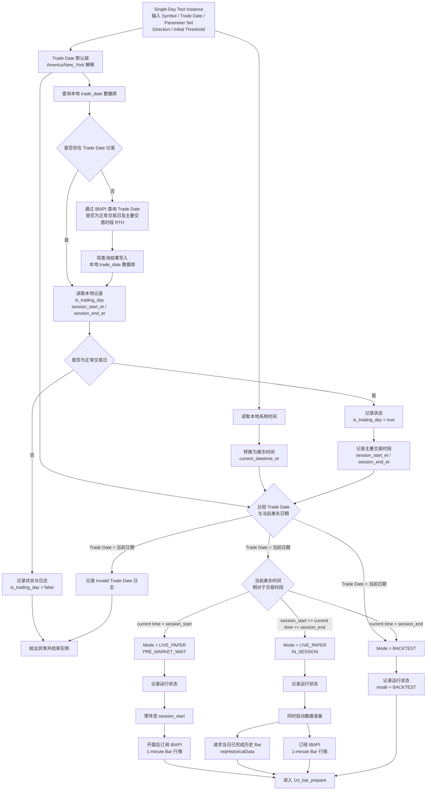
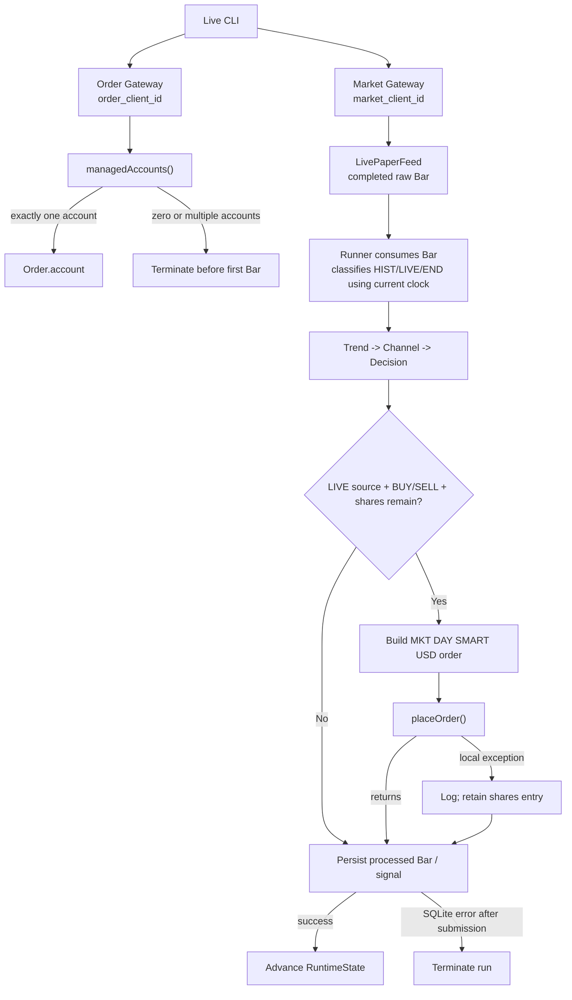
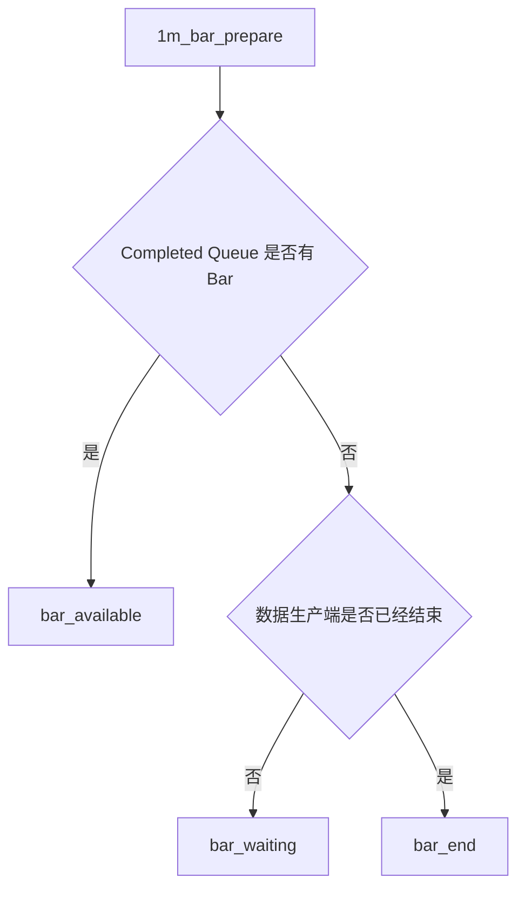
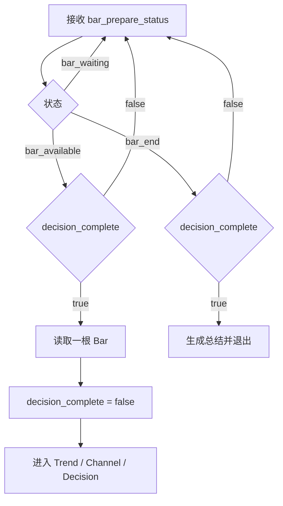
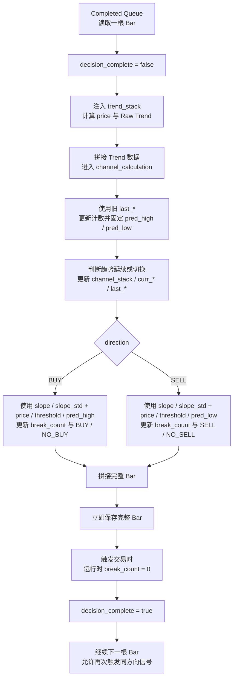
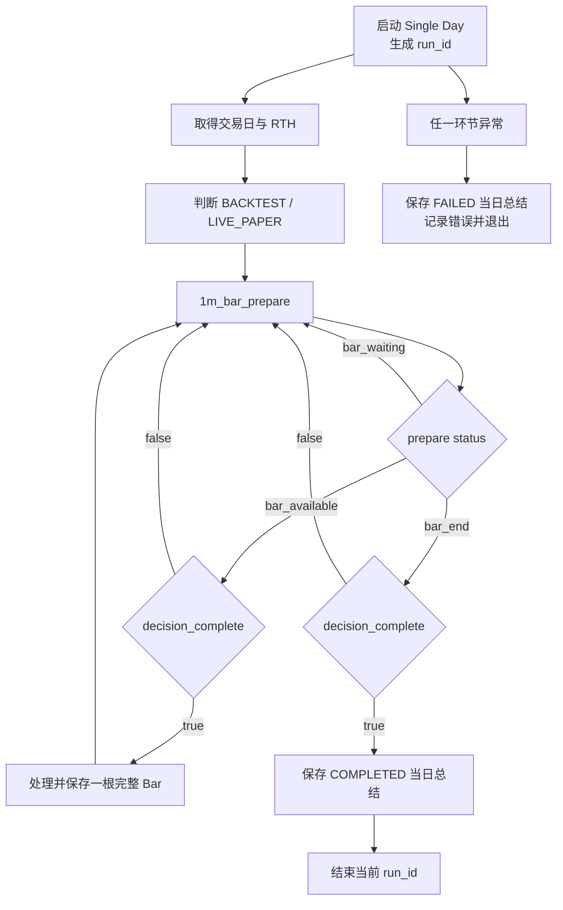
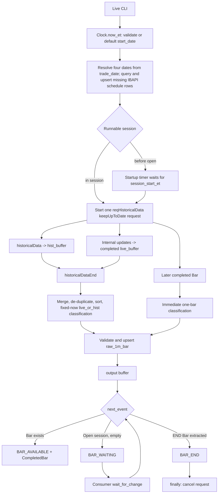

# IBAPI 单日虚拟测试流程设计记录

项目：intraday_channel_engine  
阶段：IBAPI 接入准备  
状态：当前讨论记录稿  
范围：单日、单标的、单 Parameter Set 实例

---

## 1. 设计范围

当前定义的是一个：

- 单日
- 单标的
- 单 Parameter Set
- 单买卖方向
- 单初始阈值

的测试实例。

未来如需扩展到：

- 多标的
- 多日期
- 多 Parameter Set
- 多任务并行

应在当前单日实例外部增加控制层，由外层负责调度多个实例。当前单日实例内部结构不因扩展而改变。

---

## 2. 单日实例启动输入

```text
symbol
trade_date
parameter_set
direction
initial_threshold
```

程序启动时生成：

```text
run_id = <程序开始时间 YYYYMMDD-HHMMSS>_<symbol>_<parameter_set_id>_<3 位随机字母数字字符>
```

程序开始时间使用运行机器的本地时区并精确到秒。`run_id` 不从请求 JSON 传入，
每次启动都由程序重新生成。

并初始化：

```text
active_threshold = initial_threshold
```

当前版本中，`active_threshold` 在整个 Single Day 内保持不变。

含义：

| 输入 | 说明 |
| --- | --- |
| `symbol` | 本次测试标的 |
| `trade_date` | 本次运行对应的交易日期 |
| `parameter_set` | 本次运行使用的参数集 |
| `direction` | `BUY` 或 `SELL` |
| `initial_threshold` | 本次运行的初始阈值 |
| `run_id` | 当前 Single Day 运行实例的唯一标识，由程序开始时间、`symbol`、`parameter_set_id` 和 3 位随机字母数字字符组成 |

建议入口形式：

```python
run_single_day_test(
    symbol,
    trade_date,
    parameter_set,
    direction,
    initial_threshold,
)
```

---

## 3. 时间规则

### 3.1 输入时间

所有未显式携带时区的输入日期时间，默认按以下时区解释：

```text
America/New_York
```

### 3.2 当前系统时间

程序读取本地系统时间后，统一转换为：

```text
America/New_York
```

当前 Phase 0 的 datetime 规则：

- naive datetime 无效，并抛出 `InputValidationError`。
- 非 `America/New_York` 时区的 aware datetime 通过 `astimezone` 统一转换为 `America/New_York`。
- 不会静默解释 naive datetime。

之后所有：

- 日期比较
- 交易时段判断
- Live / Backtest 判断
- RTH 是否结束判断

均使用美东时间。

---

## 4. 交易日与主要交易时段准备

程序启动后，先在本地 `trade_date` 数据库中查询当前 `trade_date`。

### 4.1 本地已有记录

若本地数据库中已有该日期记录，则直接读取：

```text
is_trading_day
session_start_et
session_end_et
```

不再调用 IBAPI 查询交易日信息。

### 4.2 本地没有记录

若本地数据库中没有该日期记录，则通过 IBAPI 查询：

1. `trade_date` 是否为正常交易日；
2. 当日主要交易时段 RTH；
3. RTH 开始时间；
4. RTH 结束时间。

查询成功后，将结果保存到本地 `trade_date` 数据库，供当前实例及后续实例复用。

### 4.3 非交易日处理

无论数据来自本地数据库还是 IBAPI，若该日期不是正常交易日：

```text
记录日志
is_trading_day = false
抛出异常
结束当前实例
```

若是正常交易日：

```text
is_trading_day = true
记录 session_start_et
记录 session_end_et
```

模式判断必须在交易日和交易时段取得后执行。

---

## 5. Live Paper / Backtest 判断

### 5.1 基本规则

```text
trade_date < current_et_date
    -> BACKTEST

trade_date > current_et_date
    -> INVALID
    -> 记录日志
    -> 抛出异常并退出
```

当：

```text
trade_date == current_et_date
```

时，需要进一步根据当前美东时间判断。

### 5.2 当天盘后

若：

```text
current_datetime_et > session_end_et
```

则当天盘后按：

```text
BACKTEST
```

处理。

### 5.3 当天盘前

若：

```text
current_datetime_et < session_start_et
```

则进入：

```text
LIVE_PAPER
live_phase = PRE_MARKET_WAIT
```

流程：

1. 等待至当日 RTH 开盘；
2. 开盘后订阅 IBAPI 1-minute Bar 行情；
3. 进入 Live Paper 数据处理。

### 5.4 当天盘中

若：

```text
session_start_et <= current_datetime_et <= session_end_et
```

则进入：

```text
LIVE_PAPER
live_phase = IN_SESSION
```

同时执行：

1. 使用 IBAPI 请求当日已完成的历史 1-minute Bar；
2. 立即开启 1-minute Bar 行情订阅。

历史数据用于补齐程序启动前已经完成的 Bar；实时订阅用于接收启动后的 Bar。

---

## 6. 单日启动与模式判断流程



---

## Phase 3 Expand Current State

Backtest now uses the YAML-first CLI to loop selected parameter sets and
inclusive calendar dates. Each parameter set receives one generated `run_id`;
daily `single_day_run` records use `(run_id, trade_date)`, while scan-level
`run_summary` records use `run_id`. `SKIPPED` non-trading days and `FAILED`
days do not stop later dates, and one multi-day CSV is exported after all dates.
The current SQLite schema metadata is `dual_backtest_reward_v1`; initialization
creates missing tables without rebuilding existing data and forward-adds
dedicated Channel-mix processed-bar and dual-Reward summary columns when
absent; existing rows are not recalculated and appended fields remain null.
Auto Threshold resets each date,
initializes from the first completed Bar raw `open`, and applies
signal-driven updates to the following Bar. Numeric thresholds with an
explicit numeric update rate, including zero, select Auto; null or omitted
rates keep numeric thresholds Fixed. A null threshold remains Auto and
initializes from the first completed Bar raw `open` in both Backtest and Live
Paper.

## 7. `1m_bar_prepare` 模块

### 7.1 模块职责

`1m_bar_prepare` 是 Live Paper 与 Backtest 共用的 1-minute Bar 准备模块。

职责：

1. 准备指定交易日的 RTH 1-minute Bar；
2. 管理历史补齐数据、实时订阅数据和初始化缓冲；
3. 仅在 Backtest 读取本地数据时，校验 Bar 的时间完整性和数值合法性；
4. 按 timestamp 去重并排序；
5. 只将已完成 Bar 放入 `Completed 1m Bar Queue`；
6. 输出 `bar_available`、`bar_waiting` 或 `bar_end`。

该模块不处理：

```text
decision_complete
Trend
Channel
Decision
订单
```

---

## 8. 1-minute Bar 时间和数据规则

### 8.1 Timestamp

统一规定：

```text
Bar timestamp = 当前分钟的开始时间
RTH = [session_start_et, session_end_et)
```

正常美股交易日：

```text
RTH = [09:30, 16:00)
expected_bar_count = 390
第一根 timestamp = 09:30
最后一根 timestamp = 15:59
```

半日交易根据当日实际 `session_start_et` 和 `session_end_et` 计算预期分钟序列。

### 8.2 Backtest 时间完整性检查

该检查只适用于 Backtest 从本地读取指定交易日完整 RTH 数据的分支。

Live Paper 不执行该完整性检查。

Backtest 的一组完整 RTH Bar 必须同时满足：

```text
timestamp 唯一
timestamp 严格递增
每个预期 RTH 分钟都存在
不包含 RTH 之外的 Bar
实际数量等于 expected_bar_count
```

只比较 Bar 数量不足以证明数据完整。

### 8.3 Backtest 数值合法性检查

该检查适用于 Backtest 读取本地数据，以及本地数据无效后通过 IBAPI 重新拉取的数据。

每根 Bar 必须满足：

```text
open / high / low / close 均非空
volume 非空且 volume >= 0

open > 0
high > 0
low > 0
close > 0

high >= open
high >= close
high >= low

low <= open
low <= close
```

---

## 9. Live Paper Bar 准备

> 本节早期 Live Paper flow 已由文末的
> Earlier Phase 4 text is superseded by the current-state section below.

### 9.1 盘前启动

盘前启动时：

1. 等待至 `session_start_et`；
2. 启动实时 1-minute Bar 订阅；
3. 初始化完成后，新的已完成实时 Bar 标记为：

```text
bar_source = LIVE
```

### 9.2 盘中启动

盘中启动时：

1. 先启动实时订阅；
2. 同时请求当日已完成的历史 1-minute Bar；
3. 历史请求完成前，实时订阅产生的已完成 Bar 暂存于：

```text
live_buffer
```

4. 历史请求完成后，将历史 Bar 与 `live_buffer` 合并；
5. 按 timestamp 去重；
6. 按 timestamp 升序排列；
7. 不执行 Backtest 的时间完整性检查；
8. 将初始化阶段合并得到的全部 Bar 统一标记为：

```text
bar_source = HIST
```

9. 将这些 Bar 按顺序加入 `Completed 1m Bar Queue`；
10. 初始化完成后，新产生的实时完整 Bar 才标记为 `LIVE`。

Live Paper 不要求：

```text
已经取得全天 expected_bar_count
每个未来 RTH 分钟都已经存在
```

未来接入下单后：

```text
HIST Bar
    可以用于构建启动时的 Trend、Channel、Decision 状态
    不允许触发实际订单

LIVE Bar
    才允许在 Decision 满足条件后进入下单模块
```

Phase 5 当前态尚未接入下单，因此 `HIST/LIVE` 只作为来源字段保存；下面的
Phase 7 规则在其实现后取代这一限制。

## Phase 7 Flow: Live Paper Order Submission

Phase 7 moves the final `HIST` / `LIVE` decision from Feed output to Runner
consumption. The rule itself is unchanged and uses the injected clock at the
time the Bar is handed to the consumer: the final session Bar is `END`, the
preceding current-minute Bar is `LIVE`, and earlier Bars are `HIST`. The same
result is persisted as `processed_1m_bar.bar_source` and controls whether an
order may be submitted.



The Live YAML `shares` list is required and contains positive integer
quantities. CLI `--shares` replaces it and accepts comma or whitespace
separators. A normally returning `placeOrder()` consumes the current entry;
there is no order acknowledgement, fill, status, funds, holdings, or position
check.

SQLite persistence errors are raised and terminate the run. A completed-Bar
timeout is handled by the outer Live recovery loop; IBAPI system connection
notifications only log, so their effect is observed through that timeout if
the subscription stops delivering Bars. Order connection startup retries three
times and then terminates; a later submission performs one final reconnect
attempt before logging and skipping on failure.

### 9.3 实时 Bar 完成条件

实时更新中的未完成 Bar 不进入 Queue。

只有该分钟已经结束、Bar 不再更新时，才视为完整 Bar并加入 Queue。

---

## 10. Backtest Bar 准备

### 10.1 本地读取

从 `raw_1m_bar` 读取指定：

```text
symbol
trade_date
RTH
```

的全部 Bar。

读取后执行：

```text
时间完整性检查
数值合法性检查
```

### 10.2 本地数据有效

若所有检查通过：

1. 按 timestamp 升序排列；
2. 标记：

```text
bar_source = HIST
```

3. 按顺序加入 `Completed 1m Bar Queue`。

### 10.3 本地数据无效

任一时间或数值检查失败时：

1. 通过 IBAPI 重新请求当日完整 RTH 1-minute Bar；
2. 对重新取得的数据再次执行全部校验；
3. 校验通过后，upsert 至 `raw_1m_bar`；
4. 排序、标记为 `HIST` 并加入 Queue。

重新请求后仍不完整或不合法：

```text
记录错误
标记 Single Day 失败
抛出异常
退出当前实例
```

---

## 11. `1m_bar_prepare` 输出状态

### 11.1 `bar_available`

```text
Completed 1m Bar Queue 中至少有一根 Bar
```

### 11.2 `bar_waiting`

```text
Completed 1m Bar Queue 为空
但当前模式下仍可能产生或补齐新的 Bar
```

### 11.3 `bar_end`

Backtest 中：

```text
全部历史 Bar 已完成入队
Completed Queue 为空
```

Live Paper 中，必须同时满足：

```text
当前时间已经超过 session_end_et
Completed Queue 为空
live_buffer 为空
历史补齐已经完成
最后一根预期 RTH Bar 已经收到并完成入队
```

`decision_complete` 不属于 `1m_bar_prepare` 的判断条件。



---

## 12. `signal_process`

### 12.1 状态

初始：

```text
decision_complete = true
```

含义：

```text
true
    上一根 Bar 已完成全部计算并成功保存

false
    当前已有一根 Bar 正在处理
```

### 12.2 Bar 消费规则

```text
bar_available + decision_complete = true
    -> 从 Queue 读取一根 Bar
    -> decision_complete = false
    -> 进入 Trend 计算

bar_available + decision_complete = false
    -> 不读取下一根 Bar
```

### 12.3 当日结束

```text
bar_end + decision_complete = false
    -> 等待当前 Bar 完成

bar_end + decision_complete = true
    -> 生成当日总结
    -> 标记 Single Day 完成
    -> 退出当前实例
```



---

## 13. `trend_stack` 与 Raw Trend

### 13.1 Stack

每根读取的 Bar 注入：

```text
trend_stack
```

最大长度：

```text
trend_window
```

默认：

```text
trend_window = 30
```

注入后超过 `trend_window` 时，移除最旧 Bar。

Current Parameter Set window fields are:

```text
trend_window
channel_window
```

`trend_window` also limits the valid-slope history used for `slope_std`.

### 13.2 基础价格

无论 Stack 长度是否达到 3，每根 Bar 都计算：

```python
price = (high + low + close) / 3
```

### 13.3 趋势参数预热

当：

```text
len(trend_stack) < 3
```

时：

```text
slope = null
r2 = null
slope_rmse = null
slope_std = null
trend_fit_ok = null
raw_trend = null
```

该 Bar 仍继续进入 Channel、Decision 和保存流程。

### 13.4 回归参数

当 `len(trend_stack) >= 3` 时，使用最近：

```text
max_count = trend_window
```

的当日 Bar 计算：

```python
slope = linear_regression_slope(trend_bars.price)
r2 = linear_regression_r2(trend_bars.price)
slope_rmse = linear_regression_rmse(trend_bars.price)
```

### 13.5 `slope_std`

`slope_std` uses at most the latest `trend_window` non-null slopes, including
the slope calculated for the current Bar.

最少需要：

```text
2 个非空 slope
```

不足 2 个时：

```text
slope_std = null
raw_trend = null
```

标准差使用总体标准差：

```text
ddof = 0
```

概念形式：

```python
slope_std = std(valid_slopes, ddof=0)
```

### 13.6 Raw Trend

```python
trend_fit_ok = r2 >= r2_threshold

if slope_std is None:
    raw_trend = None
elif trend_fit_ok and slope > slope_std:
    raw_trend = UP
elif trend_fit_ok and slope < -slope_std:
    raw_trend = DOWN
elif trend_fit_ok:
    raw_trend = SIDEWAY
else:
    raw_trend = None
```

计算结果拼接回原始 Bar，形成 `enriched_bar`。

---

## 14. `channel_calculation`

### 14.1 单日状态

```text
channel_stack
effective_trend

last_trend_slope
last_trend_intercept
last_trend_bar_count
last_high_percentile
last_low_percentile

curr_trend_slope
curr_trend_intercept
curr_high_percentile
curr_low_percentile
```

单日开始时：

```text
channel_stack = empty
effective_trend = null

last_* = null
curr_* = null
last_trend_bar_count = null
```

`channel_stack` retains at most the latest `channel_window` Bars. The bounded
stack is the source for the current Channel regression and deviation
percentiles, with the delayed selection rule described in section 14.6.

### 14.2 `last_*` 与 `curr_*`

```text
last_*
    最近一个已经结束且 curr_* 有效的趋势段留下的 Channel 参数
    在新的有效 curr_* 替换它之前保持不变
    用于计算 pred_high / pred_low

curr_*
    当前 effective_trend 对应的 channel_stack 实时参数
    随着当前 Bar 加入 channel_stack 持续更新
```

字段：

```text
last_trend_slope
last_trend_intercept
last_high_percentile
last_low_percentile

curr_trend_slope
curr_trend_intercept
curr_high_percentile
curr_low_percentile
```

`last_trend_bar_count` 是相对于 `last_*` 回归终点的预测 X 坐标，不是当前趋势段长度。

`last_*` 对应趋势段最新 Bar 的回归坐标为：

```text
x = 0
```

离开该趋势段后的第一根 Bar 为：

```text
x = 1
```

第一次产生有效 `last_*` 之前：

```text
last_trend_bar_count = null
pred_high = null
pred_low = null
```

### 14.3 每根 Bar 的 Channel 处理顺序

每根 Bar 的顺序固定为：

```text
1. 使用进入当前 Bar 前的 last_* 和 last_trend_bar_count
2. 更新旧 last_* 模型的预测位置
3. 计算并固定当前 Bar 的 pred_high / pred_low
4. 判断 raw_trend 是否导致 effective_trend 改变
5. 如发生趋势切换，先使用切换前的 curr_* 更新 last_* 和计数
6. 再更新 effective_trend 和 channel_stack
7. 根据更新后的 channel_stack 计算新的 curr_*
```

因此：

```text
当前 Bar 的 pred_high / pred_low
    始终来自趋势切换判断之前的旧 last_*

趋势切换后产生的新 last_*
    不重新计算当前 Bar 的 pred_high / pred_low
    从下一根 Bar 开始参与预测
```

同一条完整 Bar 记录中：

```text
pred_high / pred_low
    是当前 Bar 在 Channel 入口处使用旧 last_* 得到的预测

last_* / curr_*
    是当前 Bar 完成全部 Channel 处理后的状态
```

### 14.4 当前 Bar 的预测

只有以下五项全部非空时，才允许计算预测：

```text
last_trend_slope
last_trend_intercept
last_trend_bar_count
last_high_percentile
last_low_percentile
```

任意一项为空：

```text
pred_high = null
pred_low = null
```

当有效 `last_*` 已经存在时，当前 Bar 先执行：

```text
last_trend_bar_count += 1
```

再计算：

```python
pred_center = (
    last_trend_slope * last_trend_bar_count
    + last_trend_intercept
)

pred_high = pred_center + last_high_percentile
pred_low = pred_center - last_low_percentile
```

计算完成后，当前 Bar 的 `pred_high/pred_low` 固定，不因后续趋势切换而重算。

### 14.5 Channel Stack 分支

#### A. Stack 为空，`raw_trend` 非空

```text
effective_trend = raw_trend
将当前 Bar 压入 channel_stack
根据更新后的 channel_stack 计算 curr_*
```

第一次有效 `last_*` 尚未产生时：

```text
last_trend_bar_count 保持 null
pred_high = null
pred_low = null
```

#### B. Stack 为空，`raw_trend` 为空

```text
effective_trend = null
不压入 channel_stack
curr_* = null
```

`last_*` 尚未产生时，`last_trend_bar_count` 保持 `null`。

#### C. 当前趋势延续

当：

```text
channel_stack 非空
且满足以下任一条件：

raw_trend = null
raw_trend = channel_stack 最新 Bar 的 effective_trend
```

处理：

```text
effective_trend = channel_stack 最新 Bar 的 effective_trend
将当前 Bar 压入 channel_stack
根据更新后的 channel_stack 重新计算 curr_*
```

`raw_trend = null` 只表示当前 Bar 无法确认新趋势，不终止当前 `effective_trend`。

#### D. 趋势发生变化

当：

```text
channel_stack 非空
raw_trend 非空
raw_trend != channel_stack 最新 Bar 的 effective_trend
```

当前 Bar 的 `pred_high/pred_low` 已经使用旧 `last_*` 计算完成，然后执行：

```text
如果趋势切换前的 curr_* 全部非空：
    last_* = 趋势切换前的 curr_*
    last_trend_bar_count = 1

如果趋势切换前的 curr_* 任意为空：
    last_* 保持原值不变
    last_trend_bar_count 不重置
    如果 last_* 尚未产生，则 last_trend_bar_count 继续保持 null

effective_trend = raw_trend
清空 channel_stack
将当前 Bar 压入新的 channel_stack
根据新 channel_stack 计算新的 curr_*
```

当 `curr_*` 全部有效时：

```text
last_* = curr_*
last_trend_bar_count = 1
```

表示当前趋势变化 Bar 是相对于刚结束趋势回归终点的第 1 根 Bar。

该新 `last_*` 从下一根 Bar 开始参与预测；下一根 Bar 先将计数递增为 `2`，再计算 `pred_high/pred_low`。

当 `curr_*` 为空时：

```text
last_* 模型没有变化
last_trend_bar_count 继续累计真实预测距离
```

### 14.6 `curr_*` 实时计算

每次当前 Bar 压入 `channel_stack` 后：

```text
len(channel_stack) < 3
    -> curr_* = null
```

当：

```text
len(channel_stack) >= 3
```

时，先按 `delay = trend_window // 2` 从旧到新选择用于计算的 Bar，再重新计算 `curr_*`。

`channel_stack` 按 timestamp 从旧到新排列。长度为 `n` 时，选择规则为：

```text
n <= delay:
    使用 channel_stack[0:n]

delay < n <= 2 * delay:
    使用 channel_stack[0:delay]

n > 2 * delay:
    使用 channel_stack[0:n-delay]
```

Python 切片的右边界不包含，因此第三段使用第 `0` 根到第 `n-delay-1` 根。
由于 `n <= channel_window`，用于计算的 Bar 数量也不会超过 `channel_window`。

对被选中的 Bar，长度记为 `m`：

```text
x = [-(m-1), ..., -2, -1, 0]
```

例如长度为 4：

```text
x = [-3, -2, -1, 0]
```

最新 Bar：

```text
x = 0
```

因此：

```text
curr_trend_intercept
    = 最新 Bar 位置的回归中心值
```

回归：

```python
predicted_price = curr_trend_slope * x + curr_trend_intercept
```

偏差统一取正距离：

```python
high_deviation = abs(bar.high - predicted_price)
low_deviation = abs(predicted_price - bar.low)
```

Parameter Set 中的百分位参数采用 `0–100` 表示法，例如：

```text
channel_high_percentile = 95
channel_low_percentile = 95
```

计算统一使用 NumPy 线性插值：

```python
curr_trend_slope = linear_regression_slope(
    channel_stack.price,
    x=[-(n - 1), ..., -1, 0],
)

curr_trend_intercept = regression_value_at_x_0

curr_high_percentile = np.percentile(
    high_deviation,
    parameter_set.channel_high_percentile,
    method="linear",
)

curr_low_percentile = np.percentile(
    low_deviation,
    parameter_set.channel_low_percentile,
    method="linear",
)
```

趋势变化时不重新回归旧 Stack。趋势切换前的 `curr_*` 已经是旧趋势段的最新结果。

### 14.7 每根 Bar 的 Channel 输出

```text
pred_high
pred_low
effective_trend

last_trend_slope
last_trend_intercept
last_trend_bar_count
last_high_percentile
last_low_percentile

curr_trend_slope
curr_trend_intercept
curr_high_percentile
curr_low_percentile

channel_stack_length_after
```

保存语义：

```text
pred_high / pred_low
    当前 Bar 使用 Channel 入口处旧 last_* 得到的实际预测

effective_trend / last_* / curr_* / channel_stack_length_after
    当前 Bar 完成 Channel 处理后的最终状态
```

### 14.8 当日结束

`bar_end` 时：

```text
不执行 last_* = curr_*
不修改任何历史 Decision
```

当日总结记录：

```text
最终 curr_*
最终 channel_stack 长度
```

---

## 15. `decision`

### 15.1 状态和参数

```text
break_count
opposite_seen
break_trend
trend_changed
```

初始：

```text
break_count = 0
opposite_seen = true
break_trend = null
trend_changed = true
```

Parameter Set：

```text
continuous_break_count
```

Decision 统一使用：

```text
price
active_threshold
```

Before price and slope checks, Decision advances its rearm state. The day begins
open. After an actual signal, it stores the signal Bar's `effective_trend` as
`break_trend` and sets both `trend_changed` and `opposite_seen` false. A later
non-null effective trend different from `break_trend` latches `trend_changed`.
Only then does BUY latch `opposite_seen` on DOWN or SELL on UP. Both flags must
be true before break counting resumes; the Bar that completes the sequence may
also be evaluated for a signal.

其中：

```text
active_threshold = initial_threshold
```

当前版本全天不更新。

### 15.2 BUY

```text
opposite_seen = false
    -> NO_BUY
    -> break_count = 0

trend_changed = false
    -> NO_BUY
    -> break_count = 0

pred_high = null
    -> NO_BUY
    -> break_count = 0

slope = null or slope_std = null
    -> NO_BUY
    -> break_count = 0

slope < slope_std
    -> NO_BUY
    -> break_count = 0

price >= active_threshold
    -> NO_BUY
    -> break_count = 0

price < active_threshold
且 price <= pred_high
    -> NO_BUY
    -> break_count = 0

price < active_threshold
且 price > pred_high
    -> break_count += 1
```

随后：

```text
break_count >= continuous_break_count
    -> BUY

break_count < continuous_break_count
    -> NO_BUY
```

### 15.3 SELL

SELL 与 BUY 相反，使用 `pred_low`：

```text
opposite_seen = false
    -> NO_SELL
    -> break_count = 0

trend_changed = false
    -> NO_SELL
    -> break_count = 0

pred_low = null
    -> NO_SELL
    -> break_count = 0

slope = null or slope_std = null
    -> NO_SELL
    -> break_count = 0

slope > -slope_std
    -> NO_SELL
    -> break_count = 0

price <= active_threshold
    -> NO_SELL
    -> break_count = 0

price > active_threshold
且 price >= pred_low
    -> NO_SELL
    -> break_count = 0

price > active_threshold
且 price < pred_low
    -> break_count += 1
```

随后：

```text
break_count >= continuous_break_count
    -> SELL

break_count < continuous_break_count
    -> NO_SELL
```

### 15.4 触发 Bar 的 `break_count`

BUY 或 SELL 触发时：

1. 不在 Decision 判断完成后立即清零；
2. 将触发时达到的 `break_count` 写入完整 Bar；
3. 完整 Bar 保存成功后，再将运行时：

```text
break_count = 0
opposite_seen = false
break_trend = current effective_trend
trend_changed = false
```

不另外增加 `trigger_break_count` 字段。

### 15.5 同一实例内的多次触发

同一个 `run_id` 内允许多次产生同方向信号。

每次 BUY 或 SELL 后：

```text
触发 Bar 保存实际 break_count
保存成功后运行时 break_count = 0
后续 Bar 继续执行 Decision
允许再次产生同方向 BUY 或 SELL
实例持续运行至 bar_end
```

---

## 16. 完整 Bar 保存

每根 Bar 最终拼接：

```text
运行实例数据
原始 Bar 数据
Trend 数据
Channel 数据
Decision 数据
```

运行实例数据至少包括：

```text
run_id
symbol
trade_date
parameter_set_id 或完整参数快照
direction
initial_threshold
active_threshold
mode
bar_source
```

Decision 数据至少包括：

```text
decision
break_count
continuous_break_count
```

处理顺序：

```text
完成 Trend
-> 完成 Channel
-> 完成 Decision
-> 拼接完整 Bar
-> 立即实际保存
-> 如触发 BUY / SELL，清零运行时 break_count
-> decision_complete = true
```

必须每根 Bar 保存成功后，才能设置：

```text
decision_complete = true
```

不使用 15 根批量保存。

---

## 17. 当日总结

当：

```text
bar_end
且 decision_complete = true
```

时，生成并保存当日总结。

至少包括：

```text
run_id
symbol
trade_date
mode
direction
parameter_set_id 或完整参数快照
initial_threshold

总 Bar 数
BUY / SELL 触发总次数
每次触发的 timestamp
每次触发的 price
每次触发的 break_count

最终 curr_trend_slope
最终 curr_trend_intercept
最终 curr_high_percentile
最终 curr_low_percentile
最终 channel_stack_length

运行状态
开始时间
结束时间
错误信息
```

运行状态：

```text
COMPLETED
FAILED
```

正常结束时：

```text
运行状态 = COMPLETED
错误信息 = null
```

异常或程序中断时：

```text
运行状态 = FAILED
保存已经能够取得的总结字段
保存错误信息
```

当日总结不额外执行：

```text
last_* = curr_*
```

---

## 18. 异常处理

以下任一环节异常：

```text
Bar 准备或校验
Trend 计算
Channel 计算
Decision 计算
完整 Bar 保存
当日总结保存
```

统一处理：

```text
记录错误日志和当前 Bar
标记 Single Day 失败
保存 FAILED 当日总结和错误信息
抛出异常
退出当前 Single Day
```

异常时不等待 `decision_complete` 重新变为 `true`。

当前版本不考虑：

```text
Live Paper 意外中断后的恢复
状态重放
独立 checkpoint
从中断位置继续
```

中断后当前 Single Day 视为失败。

---

## 19. 单根 1-minute Bar 完整闭环



---

## 20. 单日完整闭环



---

## Phase 4 Current State (2026-07-14)

本节覆盖本文件之前的 Phase 4 Live Paper flow。



### 日期与启动

传入 `start_date` 必须是 `YYYY-MM-DD`，且不得早于今日 ET；未传入时以今日
ET 为起点。起点起连续四天的交易日、开盘和收盘信息先从 `trade_date` 读取，
缺少所需记录时从 IBAPI 查询并 upsert。必要交易时间为空表示不能交易；传入的
日期不是交易日时直接报错。盘前/未来日期等待的 timer 只负责在
`session_start_et` 触发请求，并非 Bar consumer 的等待。
传入当天日期但已盘后时直接报错；未传入日期而当天已盘后时选择下一个交易日。

### 请求、buffer 与分类

```text
endDateTime = ""
durationStr = max(60 seconds, ceil(now_et - session_start_et) + 10 seconds)
barSize = "1 min"
whatToShow = "TRADES"
useRTH = 1
formatDate = 2
keepUpToDate = True
```

不使用独立实时订阅。`hist_buffer` 不再负责按开盘时间筛选；请求 duration 与
`useRTH=1` 仅过滤非 RTH 数据，并不把结果限制在目标交易日。当 `durationStr` 大于当日
可用的 RTH 数据量时，IBAPI 会跳过非 RTH 时间并继续向前返回上一交易日的盘中 RTH Bar；
因此固定余量保持为 `+10 seconds`。收到的 timestamp 仍须校验属于目标 session。IBKR 可能在
初始 historical callback 的第一根附带上一 session 最后一根 RTH Bar；完成结构校验后，
该第一根仅作为 callback boundary 忽略。其余 session 外 timestamp 均为错误。内部只把
complete Bar 放入 `live_buffer`。新 timestamp 到达时，上一根视为 complete。
收到 historical end 后，合并两个 buffer 的 complete Bar；volume 更大者胜出，
volume 相同但字段不同则保留 live 并记录两根。批次内固定一个 `now_et`，当前分钟
减一为 `LIVE`，更早为 `HIST`。后续 complete Bar 立即处理。最后一根
`session_end_et - 1 minute` 在收盘时成为 `END`；`END` 替代 HIST/LIVE，且不交易。

### 输出、结束与失败

每根 complete Bar 先 upsert 至现有字段的 `raw_1m_bar`，成功后才进入 output
buffer。`raw_1m_bar` 不存 HIST/LIVE/END。output 有 Bar 时发出 `AVAILABLE`；
END Bar 也先以 AVAILABLE 被取出，下一次才是 `END`。未收盘且 output 为空时发出
`WAITING`，consumer 调用 `wait_for_change()`。

收盘后最后 Bar 缺失最多等待 60 秒，之后抛错退出。已输出 timestamp 的重复 Bar
或晚于输出顺序的旧 Bar 会记录完整 raw Bar、原因和最后输出 timestamp，随后跳过；
同一批次后续有效 Bar 继续处理。其他预期外错误直接终止；无论成功或失败，fetch
模组均在 `finally` 取消请求。

## Current run statistics flow (2026-07-15)

`raw_1m_bar` writes the canonical IBAPI epoch `date` and an America/New_York,
zone-aware, minute-rounded ISO `timestamp`; its `(symbol, date)` key is
unchanged. At the terminal state of a daily run, persisted processed Bars and
signal events produce `single_day_run.first_threshold`, `signal_count`, and
direction-aware `best_price`. Backtest ordered signal prices additionally
produce `first_trigger_reward` and `full_position_reward`. Each order score is
its BUY/SELL-aware threshold improvement divided by the same-day best
improvement and clipped to `[0, 1]`; the full-position score applies weights
`1/2, 1/4, 1/8, ...`, leaving the unallocated share at zero. Missing inputs or a
non-positive directional denominator on a signaled day leave both metrics null.
A no-signal Backtest day has two zero Rewards; Live leaves both null.

After each Backtest parameter-set scan, one `run_summary` row is written for
the `run_id`. It aggregates total Bars/signals and averages from completed days
that processed Bars. It also records maximum daily signal count, both Backtest
Reward averages and maxima, plus comma-separated date-ordered ties for each
Reward maximum. No-signal days contribute zero to all three averages. Any failed
daily run marks
the scan summary FAILED; skipped days do not. Backtest retains processed records
in memory and writes one full-schema CSV per run ID instead of SQLite processed
rows. Live uses the same statistics and writes its one-day `run_summary` during
the atomic terminal persistence.

## Phase 5 Current State (2026-07-14)

Live CLI 在 Session 解析成功后、盘前等待前创建 `single_day_run`，并在等待结束后把
`LivePaperFeed` 交给 `SingleDayRunner`：

```text
LivePaperFeed -> CompletedBar -> process_bar -> processed_1m_bar/signal_event
-> atomic run_summary + single_day_run terminal status
```

## Live connection recovery current state

```text
pre-market reads -> close gateways -> wait for market open
-> connect gateways -> Live Runner
-> completed-Bar deadline exceeded by 5 minutes
-> close gateways -> restore shares from latest signal_event
-> increment recovery_count -> delay/retry same run_id
-> replay session start -> resume Live processing
```

Connection-status callbacks are logged and rely on the completed-Bar deadline
for recovery. Before the first historical callback, that deadline starts at
`max(session_start, subscription_start) + 5 minutes`; it then follows the
completed-Bar sequence. Replay upserts raw/processed Bars, preserves single events, and
does not submit orders for replayed HIST Bars. Retries use 20 seconds, one
minute, 15 minutes, then one hour until session close, when an unrecovered Run
is FAILED.

`HIST`、`LIVE`、`END` 都进入同一算法链；Phase 4 仍在输出前写入 `raw_1m_bar`。
Runner 的 `WAITING` 调用无参 `wait_for_change()`；Feed 负责在新 callback、错误、关闭、
收盘或收盘后 60 秒最终 Bar deadline 时唤醒。每个 run 默认写入
`data/logs/<run_id>.jsonl`。启动 YAML 的 `log_level` 必须为 `INFO` 或 `ERROR`：INFO 仅记录至首根成功持久化 Bar（含 IBAPI 请求/回调与策略结果），之后正常处理静默；两种等级都保留 IBAPI error 回调和终态。输入校验以 exit code 2 正常退出并写入 `input_validation_error`，不输出 traceback；Session 选择和盘前等待也记录到 console/JSONL。首根 Bar 后 Live 每五分钟仅在终端输出心跳。晚到或重复 Bar 会记录并跳过。无订单、重试、恢复或
checkpoint；真实 TWS 全天验收由用户最后执行。
# Phase 8 — Concurrent Live Paper Flow

```text
Validate one Live YAML and load one parameter set
  -> validation failure: UNKNOWN JSONL only, exit
  -> resolve session and create run_id JSONL
  -> generate process-lifetime distinct client IDs
  -> acquire per-symbol mutex
  -> connect market gateway; connect order gateway and verify one account
  -> initialize temporary_directory/<run_id>.sqlite3
  -> persist single_day_run, disconnect gateways, wait for the session
  -> reconnect and execute the unchanged Phase 7 Live/recovery loop
  -> BAR_END + COMPLETED after close only
       -> wait for master merge mutex
       -> atomically merge retained tables with source-wins upserts
       -> export processed_1m_bar to data/<run_id>.csv
       -> delete private database
  -> failed, stopped, incomplete, merge/export failure: retain private database; no merge
```

The operator launches one independent process per different symbol. Phase 8
does not add a supervisor, same-symbol coordination, account/position/funds
checks, order acknowledgement/fill tracking, or an application concurrency cap.
TWS/IBKR limits remain authoritative.

## Channel blended prediction

Channel first captures old-model predictions as `last_pred_*`, then updates the
delayed-prefix current model and computes `curr_pred_*`. Current predictions are
available from `n = 3`: they use the fitted intercept through `n <= delay`,
then use coordinate `n - delay` through `n <= 2 * delay` and fixed `delay`
afterward because the
selected prefix endpoint is then always `delay` Bars behind the current Bar.
Final `pred_*` is null before a valid last model, remains last-only while curr
is unavailable, then becomes `last * (1 - mix) + curr * mix`. `mix` is
`curr_mix_ratio` times a normalized k=4 sigmoid spanning 0 at `n = delay` to
1 at `n = 2 * delay`. A switch freezes the old current model and emits its
last prediction for that same Bar at the old current coordinate plus one. Once
the delayed prefix is stable, this starts at `delay + 1`; later last predictions
continue at `delay + 2`, `delay + 3`, and so on. An Auto signal does not reset
or freeze Channel state; it only updates the next active threshold.
