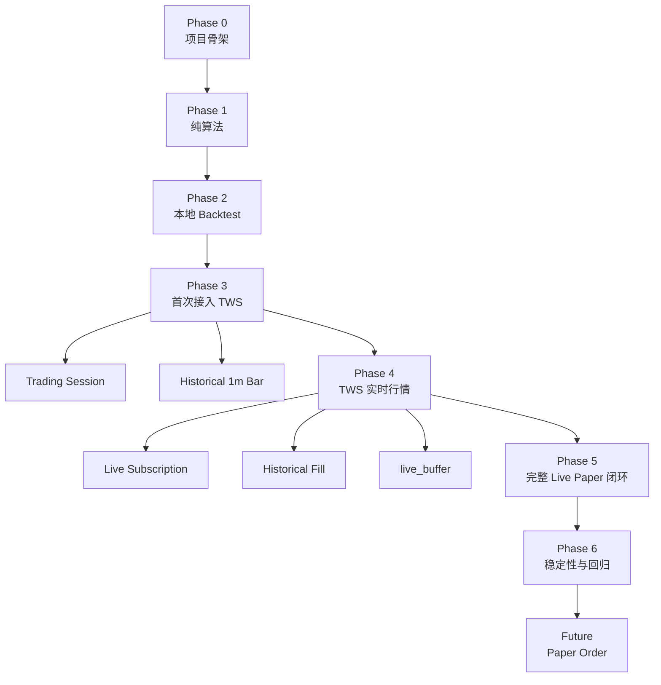

# IBAPI 单日虚拟测试开发 Phase 与验收计划

项目：intraday_channel_engine  
文档类型：分阶段开发计划与验收标准  
项目定位：全新项目  
关联文档：

```text
ibapi_single_day_test_flow_design.md
ibapi_single_day_test_development_design.md
```

---

## 1. 文档目标

本文件用于明确：

```text
开发应拆成哪些 Phase
每个 Phase 要完成什么
每个 Phase 的输入与输出
每个 Phase 的验收标准
在哪个 Phase 开始必须连接 TWS
连接 TWS 前需要准备什么
哪些 Phase 可以完全离线完成
```

当前项目范围：

```text
单日
单标的
单 Parameter Set
单方向
BACKTEST
LIVE_PAPER
不提交订单
```

当前不包含：

```text
Paper 下单
真实下单
中断恢复
checkpoint
多标的
多日批处理
```

---

## 2. Phase 总览

| Phase | 名称 | 是否需要 TWS | 主要目标 |
| --- | --- | --- | --- |
| Phase 0 | 项目骨架与领域模型 | 否 | 建立目录、模型、接口、异常体系 |
| Phase 1 | 纯算法核心 | 否 | 完成 Trend、Channel、Decision |
| Phase 2 | 本地持久化与 Backtest | 否 | 使用本地完整日数据跑通 |
| Phase 3 | IBAPI 历史数据与交易日接入 | 是 | 通过 TWS 获取交易日和历史 1m Bar |
| Phase 4 | Live Paper 行情接入 | 是 | 实现历史补齐、实时订阅、Queue |
| Phase 5 | 单日 Live Paper 完整闭环 | 是 | 从启动到收盘总结完整运行 |
| Phase 6 | 稳定性与回归验收 | 部分需要 | 对比 Backtest 与 Live 模拟结果 |
| Future Phase | Paper Order | 是 | 当前不实施，仅预留接入点 |

---

# Phase 0：项目骨架与领域模型

## 3.1 目标

建立可持续开发的项目基础，不实现算法，不连接数据库，不连接 TWS。

## 3.2 实施内容

创建目录：

```text
src/single_day_test/
├─ application/
├─ domain/
├─ engine/
├─ bar_feed/
├─ ib/
├─ persistence/
└─ support/
```

创建基础文件：

```text
domain/enums.py
domain/models.py
domain/states.py
domain/parameters.py
domain/errors.py

support/clock.py
support/ids.py
support/logging.py
```

定义：

```text
RunRequest
RunContext
ParameterSet
RawBar
CompletedBar
TrendResult
ChannelResult
DecisionResult
ProcessedBarRecord
RunSummary
RuntimeState
```

定义枚举：

```text
Direction
RunMode
LivePhase
BarSource
FeedStatus
TrendLabel
DecisionLabel
RunStatus
```

定义 Protocol：

```text
Clock
IdGenerator
BarFeed
IbGateway
各类 Repository
```

## 3.3 TWS 要求

```text
不需要 TWS
不需要 IBAPI
不需要账户登录
```

## 3.4 验收标准

必须满足：

```text
1. 项目可安装并正常 import。
2. 所有 dataclass 与 Enum 可实例化。
3. ParameterSet 校验函数完成。
4. 所有时间字段明确使用 America/New_York aware datetime。
5. Repository 与 IbGateway 仅定义接口，不包含真实实现。
6. pytest 可运行。
7. mypy 或等效静态检查无核心类型错误。
```

### Phase 0 当前实现说明

- `ParameterSet` 校验仅覆盖本文档定义的六项规则，违规时抛出 `InputValidationError`，不使用 `assert`，也不额外校验保留参数。
- naive datetime 抛出 `InputValidationError`；非 ET 的 aware datetime 通过 `astimezone` 统一为 `America/New_York`，不静默解释 naive 时间。
- `TrendState.empty(params)` 与 `RuntimeState.empty(params)` 按 `ParameterSet` 创建具有对应 `maxlen` 的 deque。
- Phase 0 仅提供 Protocol 接口，不包含数据库或 IBAPI 实现：`Clock.now_et`；`IdGenerator.new_run_id`；`StructuredLogger.info/error`；`BarFeed.start/next_event/close`；`SubscriptionHandle.close`；`IbGateway.query_trading_session/request_historical_1m_bars/subscribe_completed_1m_bars`；`TradeDateRepository.get/save`；`RawBarRepository.load_rth_bars/upsert_many`；`RunRepository.create/mark_completed/mark_failed`；`ProcessedBarRepository.insert`；`SignalRepository.insert`；`SummaryRepository.save`。

## 3.5 完成门槛

只有当领域模型不再频繁变化，才进入 Phase 1。

---

# Phase 1：纯算法核心

## 4.1 目标

在完全离线条件下，实现：

```text
Regression
TrendEngine
ChannelEngine
DecisionEngine
```

不涉及：

```text
IBAPI
TWS
数据库
Queue
真实时间
```

## 4.2 实施内容

实现文件：

```text
engine/regression.py
engine/trend_engine.py
engine/channel_engine.py
engine/decision_engine.py
```

实现核心函数：

```python
linear_regression(...)
TrendEngine.update(...)
ChannelEngine.update(...)
DecisionEngine.evaluate(...)
```

实现状态 Transition：

```text
旧状态
+ 当前 CompletedBar
+ ParameterSet
-> 当前结果
+ 下一状态
```

## 4.3 核心算法验收

### Trend

```text
前 1、2 根 Bar：
    price 正常计算
    slope/r2/rmse/slope_std/raw_trend = null

第 3 根开始：
    正常回归

slope_std：
    包含当前 slope
    最少 2 个 slope
    ddof = 0

trend_stack：
    不超过 trend_window
```

### Channel

```text
第一次有效 last_* 前：
    last_trend_bar_count = null
    pred_high = null
    pred_low = null

已有有效 last_*：
    当前 Bar 先 count += 1
    再计算 pred_*

趋势切换：
    当前 Bar 保留旧 last_* 计算的 pred_*
    新 last_* 从下一根 Bar 开始生效

curr_* 有效：
    last_* = old curr_*
    count = 1

curr_* 为空：
    last_* 不变
    count 继续累计

raw_trend = null：
    effective_trend 保持
    当前 Bar 压入 channel_stack

Channel 回归：
    x = [-(n-1), ..., 0]
    最新 Bar x = 0
    high/low deviation 取绝对值
    percentile 使用 method="linear"
```

### Decision

```text
BUY / SELL 对称
pred_* 为空时：
    NO_BUY / NO_SELL
    break_count = 0

不满足突破条件：
    break_count = 0

满足突破条件：
    break_count += 1

达到 continuous_break_count：
    触发 BUY / SELL

触发 Bar：
    保存触发时 break_count
    保存成功后才清零

同一 run_id：
    允许多次触发
```

## 4.4 TWS 要求

```text
不需要 TWS
```

## 4.5 验收标准

```text
1. Regression 单元测试通过。
2. TrendEngine 全部分支测试通过。
3. ChannelEngine 全部分支测试通过。
4. DecisionEngine BUY/SELL 全部分支测试通过。
5. Core Engine 不 import ibapi。
6. Core Engine 不 import 数据库模块。
7. Core Engine 不调用 datetime.now()。
8. 给定相同输入和初始状态，输出完全确定。
9. 单元测试覆盖率达到项目约定阈值。
```

## 4.6 完成门槛

只有算法结果已固定，才进入 Phase 2。

---

# Phase 2：本地持久化与 Backtest

## 5.1 目标

在不连接 TWS 的情况下，使用本地完整交易日 1-minute Bar 跑通整个 Single Day。

## 5.2 实施内容

实现：

```text
persistence/database.py
persistence/trade_date_repository.py
persistence/raw_bar_repository.py
persistence/run_repository.py
persistence/processed_bar_repository.py
persistence/signal_repository.py
persistence/summary_repository.py

bar_feed/completed_bar_queue.py
bar_feed/bar_validation.py
bar_feed/backtest_feed.py

application/bar_processor.py
application/single_day_runner.py
application/summary_service.py
```

实现数据库表：

```text
trade_date
raw_1m_bar
single_day_run
processed_1m_bar
signal_event
run_summary
```

## 5.3 Backtest 数据准备

手工准备：

```text
一个交易日
一个 symbol
完整 RTH 1-minute Bar
```

正常交易日示例：

```text
09:30–15:59
390 根
timestamp 为分钟开始时间
```

## 5.4 TWS 要求

```text
不需要 TWS
```

Phase 2 中，若本地数据不完整：

```text
先使用测试替身 HistoricalBarService
不连接真实 IBAPI
```

## 5.5 验收标准

```text
1. 本地完整日数据通过校验。
2. 重复 timestamp 能被识别。
3. 缺失分钟能被识别。
4. RTH 外 Bar 能被识别。
5. 非法 OHLCV 能被识别。
6. BacktestFeed 按时间顺序输出 BAR_AVAILABLE。
7. 所有 Bar 消费完后输出 BAR_END。
8. 每根 Bar 保存成功后才处理下一根。
9. processed_1m_bar 数量与输入 Bar 数一致。
10. 同一 run_id + timestamp 不重复。
11. Signal Event 与触发 Bar 一致。
12. 正常结束保存 COMPLETED Summary。
13. 人工制造异常时保存 FAILED Summary。
```

## 5.6 Phase 2 交付物

```text
可执行 Backtest CLI
数据库 schema
完整单元测试
至少一个完整日 E2E 测试
```

## 5.7 完成门槛

只有本地 Backtest 全闭环稳定，才允许开始接入 TWS。

---

# Phase 3：IBAPI 历史数据与交易日接入

### `processed_1m_bar` persistence schema rule

### Timestamp naming and timezone rule

Persisted database column names must not use the `_et` suffix. The `_et`
suffix is reserved for runtime domain fields whose value is a timezone-aware
`datetime` normalized to `America/New_York`, such as `timestamp_et`,
`session_start_et`, and `session_end_et`. IBAPI raw bar `date` remains a UTC
Unix epoch second and must retain the raw field name; it must not be renamed
to `timestamp_et`. If a timestamp is persisted as a database column, use the
name `timestamp` and document its storage representation explicitly.

Phase 3 requires `processed_1m_bar` to preserve every `RawBar` field as a
queryable column: `symbol`, `date`, `open`, `high`, `low`, `close`, `volume`,
`wap`, and `barCount` (stored as `bar_count`). The processed result must not
store the original JSON representation. Every field from the parameter
snapshot, `TrendResult`, `ChannelResult`, and `DecisionResult` is expanded
into a dedicated column with a stable prefix where needed (`trend_`,
`channel_`, and `decision_`).

The current `processed_1m_bar` schema is `phase3_ibapi_v5`. It also preserves
the raw request metadata `bar_size`, `what_to_show`, `use_rth`, and `source`.
The previous `phase3_ibapi_v1`, `phase3_ibapi_v2`, `phase3_ibapi_v3`, and `phase3_ibapi_v4` schemas are incompatible
and are cleared once during database
initialization; its data is intentionally not migrated or retained. No JSON
columns (`parameter_snapshot_json`, `trend_json`, `channel_json`, or
`decision_json`) are allowed in the current table.

The current `processed_1m_bar` table must contain no column whose name ends
with `_et`. ET timezone semantics belong only to runtime aware datetime fields; they
must not be written into the processed-bar table schema.

`processed_1m_bar.timestamp` is the bar's `America/New_York` timestamp. It is
stored with precision matching `bar_size`; Phase 3 uses `1 min`, so seconds
and microseconds are zero. The raw UTC epoch remains available in `date`.

After each run, export that run's persisted `processed_1m_bar` rows to
`data/<run_id>.csv`. The CSV field names and order must exactly match the
SQLite table. This export is additive: the existing SQLite persistence remains
unchanged and authoritative.

The CLI generates each `run_id` at program start using the format
`<YYYYMMDD-HHMMSS>_<symbol>_<parameter_set_id>_<3 alphanumeric random characters>`.
The timestamp uses the local machine timezone and has one-second precision. A request
JSON must not override the generated identifier.

### Phase 3 Expand implementation override

Phase 3 Expand adds an outer parameter-set scan and an inner inclusive
multi-date backtest. The parameter CSV has `is_active`; an empty requested ID
selects every row with `is_active = 1`, while an explicit ID selects one row.
The request uses `trade_date_start` / `trade_date_end` and one `threshold`.
Numeric values are Fixed; omitted or null is Auto. Auto Threshold resets each
date, initializes from the Nth Bar where N equals `trend_window`, and updates
after triggered BUY or SELL for the following Bar. That signal-driven update
resets Trend and Channel state for the following Bar, but not for the signal
Bar itself. The persisted `processed_1m_bar.decision` is null without a
triggered signal and is `BUY` or `SELL` when one triggers.

Each parameter set receives one generated `run_id` across all selected dates.
`single_day_run` and daily `run_summary` use `(run_id, trade_date)` keys.
Non-trading days are `SKIPPED`; failed dates continue; one final CSV aggregates
all persisted processed rows for the `run_id`. The schema is rebuilt without
retaining old data when its fields or keys do not match Phase 3 Expand.

## 6.1 目标

首次接入 TWS。

实现：

```text
交易日与 RTH 查询
历史 1-minute Bar 请求
IBAPI 回调转换
Backtest 数据自动补齐
```

该 Phase 不接实时行情。

实施状态：已实现。历史数据的原始契约固定为 IBAPI `BarData`：UTC epoch
`date`、OHLC、`volume`、`wap`、`barCount`，并保存请求元数据。旧 Phase 2
注入格式和 SQLite schema 不兼容。

## 6.2 首次需要 TWS 的节点

首次真实连接 TWS 的代码位置：

```text
ib/gateway.py
ib/callback_bridge.py
ib/trading_session_service.py
ib/historical_service.py
```

调用位置：

```text
RunContextFactory
    -> IbGateway.query_trading_session(...)

BacktestFeed
    -> HistoricalBarService.fetch_complete_rth_day(...)
```

## 6.3 TWS 准备事项

开始 Phase 3 前，应准备：

```text
1. 安装并可正常启动 TWS。
2. 使用计划测试的账户登录。
3. 程序连接目标由登录的 TWS 账户决定。
4. TWS 已允许 API 客户端连接。
5. 配置 host、port、client_id。
6. 明确使用 paper 还是其他测试环境。
7. 账户具有目标 symbol 的历史行情权限。
8. 确认目标市场交易时区。
9. 确认程序与 TWS 在同一网络可达环境。
10. 准备至少一个过去交易日用于历史数据验证。
```

建议配置：

```text
.env
```

字段：

```text
IB_HOST
IB_PORT
IB_CLIENT_ID
IB_CONNECT_TIMEOUT
```

不要把端口或账户信息硬编码在算法模块。

## 6.4 实施内容

### Gateway

实现：

```python
connect()
disconnect()
is_connected()

query_trading_session(...)
request_historical_1m_bars(...)
```

### CallbackBridge

负责：

```text
request_id -> pending request
callback -> RawBar
error code -> IbApiError
request complete -> future/event complete
```

### TradingSessionService

实现：

```text
本地 trade_date 有记录：
    返回

没有记录：
    通过 IBAPI 查询
    保存
    返回
```

### HistoricalBarService

实现：

```text
请求指定交易日完整 RTH 1m Bar
转换 timestamp
过滤非 RTH
返回 RawBar 列表
```

## 6.5 raw_1m_bar 保存节点

Phase 3 中明确：

```text
Backtest 本地数据无效
-> TWS/IBAPI 拉取完整 RTH 历史数据
-> 完整性与数值校验通过
-> upsert raw_1m_bar
```

其他 IBAPI 数据暂不写入 `raw_1m_bar`。

## 6.6 验收标准

```text
1. 程序可连接 TWS。
2. 连接失败时抛出明确异常。
3. client_id 冲突时有明确日志。
4. 可查询指定日期是否交易日。
5. 可取得 session_start_et / session_end_et。
6. 非交易日正确报错。
7. 可请求完整日 RTH 1-minute Bar。
8. 时间统一转换为 America/New_York。
9. 历史 Bar 校验通过后写入 raw_1m_bar。
10. 再次运行时优先使用本地 raw_1m_bar。
11. IBAPI 错误不会进入 Core Engine。
12. TWS 断开时当前 Run 标记 FAILED。
```

## 6.7 TWS 验收操作

人工执行：

```text
1. 启动 TWS。
2. 登录目标账户。
3. 启动程序。
4. 观察 CONNECTED 日志。
5. 请求过去某个完整交易日。
6. 对比：
   - Bar 数量
   - 第一根 timestamp
   - 最后一根 timestamp
7. 关闭 TWS，确认程序正确 FAILED。
```

## 6.8 完成门槛

只有历史数据请求稳定后，才进入实时行情阶段。

---

# Phase 4：Live Paper 行情接入

> 本章下方早期 Phase 4 描述已由本文件末尾的
> `Phase 4 Current-State Override (2026-07-14)` 覆盖；实施以该 override 为准。

## 7.1 目标

通过 TWS 接入：

```text
实时 1-minute Bar
盘中启动历史补齐
live_buffer
HIST / LIVE 标记
CompletedBarQueue
BAR_WAITING
BAR_END
```

不提交订单。

## 7.2 TWS 接入节点

新增或扩展：

```text
ib/live_bar_service.py
ib/callback_bridge.py
bar_feed/live_paper_feed.py
```

调用链：

```text
LivePaperFeed.start()
    -> IbGateway.subscribe_completed_1m_bars(...)
    -> IbGateway.request_historical_1m_bars(...)
```

回调链：

```text
TWS callback
    -> CallbackBridge
    -> LiveBarService
    -> LivePaperFeed.on_completed_live_bar(...)
    -> CompletedBarQueue
```

## 7.3 盘前启动流程

```text
程序启动
-> 取得 TradingSession
-> 判断 PRE_MARKET_WAIT
-> 等待 session_start_et
-> 启动实时订阅
-> 完成 Bar 标记 LIVE
```

## 7.4 盘中启动流程

```text
1. 先启动实时订阅
2. 请求开盘至当前的已完成历史 Bar
3. 历史完成前，完成的实时 Bar 写入 live_buffer
4. historical + live_buffer 合并
5. timestamp 去重
6. 升序
7. 全部标记 HIST
8. 放入 Queue
9. initialization_complete = true
10. 后续完成 Bar 标记 LIVE
```

## 7.5 TWS 准备事项

Phase 4 开始前额外确认：

```text
1. 目标 symbol 有实时或可用的行情权限。
2. TWS 能持续保持登录。
3. 电脑不会在测试期间休眠。
4. 网络稳定。
5. 系统时间正常。
6. 程序日志目录有足够空间。
7. 测试日选择正常交易日。
8. 预留从盘前到收盘的运行窗口。
```

## 7.6 当前明确不做的事

```text
Live 历史补齐 Bar 不写 raw_1m_bar
live_buffer Bar 不写 raw_1m_bar
实时 LIVE Bar 不写 raw_1m_bar
不下单
不中断恢复
```

## 7.7 验收标准

### 盘中启动

```text
1. 实时订阅先于历史请求完成。
2. 初始化期间的实时完整 Bar 进入 live_buffer。
3. historical 与 live_buffer 正确去重。
4. 初始化合并后的 Bar 全部标记 HIST。
5. 初始化后新 Bar 标记 LIVE。
6. Queue 内 timestamp 严格递增。
7. 未完成 Bar 不进入 Queue。
8. Live 不执行完整日数据检查。
9. Live Bar 不写 raw_1m_bar。
```

### 盘前启动

```text
1. session_start 前不产生 Bar。
2. 到达 session_start 后启动订阅。
3. 第一根完成 Bar 正确进入 Queue。
4. BarSource = LIVE。
```

### 结束条件

只有同时满足：

```text
当前时间超过 session_end_et
Completed Queue 为空
live_buffer 为空
historical_complete = true
最后一根预期 RTH Bar 已收到并入队
```

才输出：

```text
BAR_END
```

## 7.8 人工 TWS 验收

建议至少执行：

```text
一次盘前启动测试
一次盘中启动测试
一次手工断开 TWS 测试
一次网络短断测试
一次收盘结束测试
```

---

## Phase 4 Current-State Override (2026-07-14)

This section supersedes earlier Phase 4 text in this document.

Phase 4 is a dedicated Live CLI and Bar-fetch loop. Its inputs are one `symbol`,
one `BUY`/`SELL` direction, a required numeric fixed threshold,
`parameter_set_path`, `parameter_set_id`, and an optional `start_date` in
`YYYY-MM-DD`. Live does not allow an Auto threshold. It does not invoke
`process 1m bar`, strategy engines, processed-bar persistence, summaries, or
orders; those remain Phase 5 or later.

All date/time decisions use ET. A supplied start date earlier than today is an
error; an omitted date starts at today. Resolve four calendar dates, including
the start date, from `trade_date` first. Missing required dates are queried from
IBAPI and upserted. Empty required session data means the date is not tradable.
A supplied non-trading start date is an error. A separate timer waits until the
selected `session_start_et`; it then starts one request:

A supplied current-date start after that session has ended is an error. When
the start date is omitted and today's session has ended, select the next trading
day instead.

```text
reqHistoricalData(
  endDateTime="", durationStr=ceil(now_et - session_start_et) + 10 seconds,
  barSize="1 min", whatToShow="TRADES", useRTH=1, formatDate=2,
  keepUpToDate=True)
```

No independent real-time subscription is used. `useRTH=1` filters non-RTH data;
it does not constrain the result to the target date. If `durationStr` is larger
than the target date's available RTH data, IBAPI skips non-RTH time and continues
the lookback into prior-trading-date intraday RTH Bars. The `+10 seconds` margin
deliberately constrains that behavior. Session timestamp validation applies.
IBKR may prepend one pre-session final-RTH Bar as
the first initial historical callback; after structural validation, it is
ignored as a callback boundary. Any other session-external Bar is an error.
Historical callbacks fill `hist_buffer`; internal update handling puts completed
bars only in `live_buffer`. A normal bar completes when a new timestamp arrives.
On the historical end marker, merge both buffers, de-duplicate by timestamp,
sort, and process as one batch. Keep the greater-volume duplicate; for equal
volume with different fields, keep live and log both. A fixed batch `now_et`
marks the prior-minute bar `LIVE` and older bars `HIST`. Later completed bars are
processed immediately. The final bar (`session_end_et - 1 minute`) becomes
complete at session end and has source `END`, which replaces `HIST`/`LIVE` and is
not trade-eligible.

Before a completed bar is exposed, upsert it to `raw_1m_bar` using the existing
Phase 3 raw fields. Failure prevents output and raises. The raw table verifies
raw fields, timestamps, and output order only; it does not store `HIST/LIVE/END`.
The output buffer emits `AVAILABLE` with a bar, including the final `END` bar.
After that final bar is extracted, the next event is `END`. An open session with
an empty output buffer emits `WAITING`; its consumer calls `wait_for_change()`.
If the final expected bar is absent after `session_end_et + 60 seconds`, raise.
Late or repeated complete timestamps after output also raise. The fetch module
cancels the request in `finally` for both completion and failure.

All unexpected errors terminate without retry, recovery, reconnect, checkpoint,
or fallback. Phase 4 acceptance requires deterministic fake-clock/fake-callback
tests plus one real-time TWS intraday run that verifies `raw_1m_bar` and logs.

---

# Phase 5：单日 Live Paper 完整闭环

## 8.1 目标

把 Phase 4 的 LivePaperFeed 接入完整算法和持久化流程。

流程：

```text
TWS
-> LivePaperFeed
-> CompletedBarQueue
-> TrendEngine
-> ChannelEngine
-> DecisionEngine
-> processed_1m_bar
-> signal_event
-> run_summary
```

## 8.2 TWS 接入位置

本 Phase 不新增新的 TWS API 功能。

TWS 只通过以下路径进入系统：

```text
TradingSessionService
HistoricalBarService
LiveBarService
```

Core Engine 与 Persistence 不直接访问 TWS。

## 8.3 验收标准

```text
1. run_id 正常生成。
2. single_day_run 状态从 RUNNING 开始。
3. HIST Bar 可构建算法状态。
4. LIVE Bar 使用相同算法处理。
5. 每根 Bar 成功保存后才提交下一状态。
6. Signal 触发后允许后续再次触发。
7. processed_1m_bar 中 HIST/LIVE 标记正确。
8. Live 运行期间不写 raw_1m_bar。
9. 收盘后生成 COMPLETED Summary。
10. TWS 或算法异常生成 FAILED Summary。
11. feed.close() 必须执行。
12. 当前版本中断后不恢复。
```

## 8.4 完整日验收

至少完成一次从盘前到收盘的运行。

验收结果应包含：

```text
single_day_run
processed_1m_bar
signal_event
run_summary
结构化日志
```

人工核对：

```text
总 Bar 数
第一根与最后一根 timestamp
HIST/LIVE 边界
Signal timestamp
Signal price
Signal break_count
最终 curr_*
最终 channel_stack_length
Run 状态
```

---

# Phase 6：稳定性与回归验收

## 9.1 目标

验证不同数据入口不会改变算法结果。

## 9.2 测试方式

将相同的一组 Bar 分别通过：

```text
BacktestFeed
模拟 LivePaperFeed
```

输入同一 Core Pipeline。

## 9.3 验收标准

逐 Bar 对比：

```text
price
slope
r2
slope_rmse
slope_std
raw_trend
effective_trend
pred_high
pred_low
last_*
curr_*
last_trend_bar_count
break_count
decision
```

要求：

```text
全部一致
```

只允许不同：

```text
mode
bar_source
run_id
运行时间字段
```

## 9.4 TWS 要求

自动回归测试：

```text
不需要 TWS
```

真实环境复验：

```text
需要 TWS
```

## 9.5 稳定性验收

```text
1. TWS 不可用时明确失败。
2. 历史请求超时明确失败。
3. 实时回调异常明确失败。
4. 重复 timestamp 不重复消费。
5. 数据库写入失败不提交 RuntimeState。
6. Summary 写入失败使 Run FAILED。
7. 日志中可根据 run_id 重建运行过程。
```

---

# Future Phase：Paper Order 接入预留

## 10.1 当前状态

```text
不在本轮开发范围内
```

## 10.2 未来 TWS 接入位置

订单模块应接在：

```text
DecisionEngine
-> SignalEvent 成功保存
-> OrderDecision / OrderExecution
-> IbGateway.place_order(...)
```

不能把下单逻辑放入：

```text
TrendEngine
ChannelEngine
DecisionEngine
LivePaperFeed
```

## 10.3 未来下单前门槛

在开始 Paper Order 前，至少要求：

```text
1. Phase 5 完整日稳定运行。
2. Phase 6 回归结果一致。
3. Signal 定义固定。
4. run_id / signal_event 唯一性稳定。
5. TWS 连接管理稳定。
6. 订单模块有独立状态机。
7. HIST Bar 明确禁止触发实际订单。
8. 只有 LIVE Bar 允许进入下单流程。
```

---

## 11. TWS 接入时间线



---

## 12. 用户准备清单

### 在 Phase 0–2 前

```text
无需启动 TWS
准备 Python 环境
准备一个完整交易日 CSV 或数据库数据
准备 Parameter Set
```

### 在 Phase 3 前

```text
安装 TWS
确认可正常登录
启用 API 连接
确认 host / port / client_id
确认历史行情权限
准备过去交易日做测试
```

### 在 Phase 4 前

```text
确认实时行情可用
选择一个正常交易日
电脑关闭休眠
网络稳定
日志与数据库目录可写
预留盘前、盘中、收盘测试时间
```

### 在 Phase 5 前

```text
确认 Phase 3 历史接口稳定
确认 Phase 4 实时订阅稳定
确认完整 Bar 回调定义可靠
确认数据库事务测试通过
```

---

## 13. 推荐实际开发顺序

```text
第一步：
    完成 Phase 0–1
    不启动 TWS

第二步：
    完成 Phase 2
    用本地数据闭环

第三步：
    用户准备 TWS
    开发者开始 Phase 3

第四步：
    使用过去交易日测试历史请求

第五步：
    选择一个交易日进行 Phase 4 盘中测试

第六步：
    再选择一个交易日进行 Phase 5 完整日测试

第七步：
    完成 Phase 6 回归验收
```

---

## 14. 每个 Phase 的完成定义

一个 Phase 只有同时满足以下条件才视为完成：

```text
代码完成
单元测试完成
集成测试完成
错误路径测试完成
文档同步更新
验收标准逐项通过
不存在被跳过但未记录的测试项
```

不允许仅以：

```text
程序能启动
程序没有报错
某一次运行成功
```

作为 Phase 完成依据。
