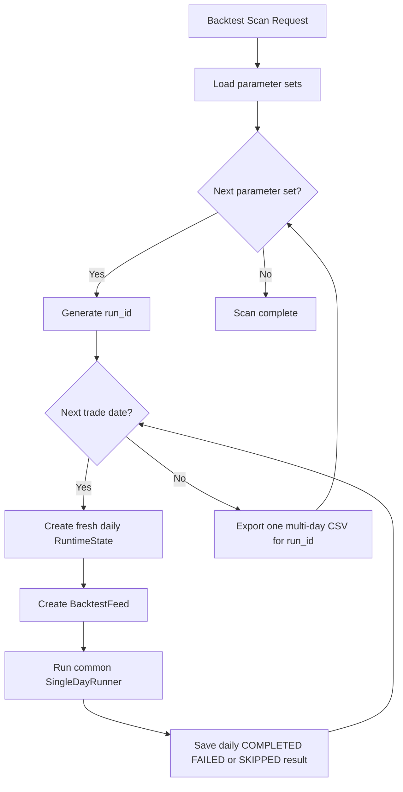
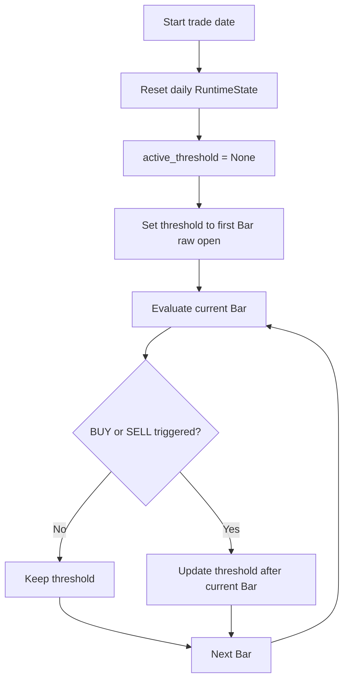

# Phase 3 Expand: Parameter Scanning, Multi-Day Backtest, and Auto Threshold

## 1. Document Status

This document records the confirmed expansion direction based on the existing
Phase 3 implementation. It is a design baseline for the next implementation
steps.

Current status: **implemented**.

## 2. Existing Phase 3 Invariants

The expansion keeps the following behavior unchanged:

- Existing runtime functionality and supported execution behavior.
- Existing data interaction and data contracts.
- Existing persisted and exported data output semantics unless explicitly
  extended for the new scan-level results.
- Existing `BarFeed` contract and completed-bar processing semantics.
- Existing `TrendEngine` behavior and state transitions.
- Existing `ChannelEngine` behavior and state transitions.
- Existing `DecisionEngine` behavior and decision-state transitions.
- Existing common processing order:

```text
CompletedBar
    -> TrendEngine
    -> ChannelEngine
    -> DecisionEngine
    -> persistence and output
```

The expansion belongs in the scan/application orchestration and threshold
state handling. The three strategy engines continue to receive the same
inputs and produce the same results for the same effective threshold.

## 3. Expansion Scope

The backtest expansion has two nested levels:

1. Outer level: scan parameter sets.
2. Inner level: run the selected parameter set over multiple trade dates.

The logical scan unit is:

```text
parameter_set
    -> multiple trade_date executions
```

Each parameter set is isolated from every other parameter set. Trend, Channel,
Decision, and Auto Threshold state must never be shared across parameter sets.

## 4. Scan Flow



The scanner is an outer orchestration layer. `SingleDayRunner` remains the
executor for one daily run and does not contain the nested scan loops.

## 5. Scan Input Contract

Backtest configuration belongs in `configs/backtest.yaml`. The sole entry point
is `python -m single_day_test.application.backtest_cli`; `--config` selects a
different YAML file and every explicitly supplied CLI option overrides only
its matching YAML field. On Windows, `./run_backtest.ps1` invokes that CLI from
the project root and forwards `--help` and all overrides unchanged. Runtime and
persisted data remains under `data/`.

Each request must contain exactly one `symbol` value. Symbol lists or multiple
symbols in one request are not supported.

The YAML uses `parameter_set_path` to select the central parameter CSV and an
optional `parameter_set_id` to control parameter-set selection. It also owns
`symbol`, `direction`, `threshold`, `threshold_update_rate`, `trade_date_start`, `trade_date_end`,
`ib_environment`, `database`, and `ib_config`.

Example:

```yaml
symbol: AAPL
direction: BUY
trade_date_start: 2026-01-02
trade_date_end: 2026-01-05
threshold: null
threshold_update_rate: 0
parameter_set_path: configs/parameter_set.csv
parameter_set_id: ""
ib_environment: paper
database: data/intraday_channel.sqlite3
ib_config: configs/ib.yaml
```

### 5.1 Parameter-set Selection

The parameter CSV adds an `is_active` column:

```text
parameter_set_id,...,is_active
set_a,...,1
set_b,...,0
```

Selection rules:

```text
parameter_set_id is empty
    -> scan every row whose is_active value equals 1

parameter_set_id is provided
    -> scan only the matching parameter_set_id
    -> ignore/overwrite its is_active value
```

Therefore a provided `parameter_set_id` always requests a single-parameter-set
scan, including when that row is not active. Values other than `1` mean that a
row is not selected by the active-set scan.

### 5.2 Date Selection

The YAML uses `trade_date_start` and `trade_date_end`.

```text
only trade_date_start is provided
    -> single-day scan on trade_date_start

only trade_date_end is provided
    -> single-day scan on trade_date_end

both are provided
    -> multi-day scan from trade_date_start through trade_date_end
```

The date range is inclusive. Configuration validation must fail and exit before execution
when:

- neither date is provided;
- `trade_date_start` is later than `trade_date_end`;
- `trade_date_end` is later than the current ET date.

Malformed or non-date values must also fail during request validation.

### 5.3 Threshold Input

The request contains one threshold field only:

```text
threshold has a numeric value
    -> FIXED threshold mode

threshold is missing or null
    -> AUTO threshold mode
```

Separate `initial_threshold` and `active_threshold` request fields are not
part of this input contract. `active_threshold` is runtime state, and the
resolved Auto initial threshold is the first completed Bar raw `open`.

`threshold_update_rate` is an optional 0-100 percentage. With a numeric
threshold, a numeric rate (including `0`) selects Auto and uses that threshold
as the initial active threshold; null or omission selects Fixed mode. A null
threshold remains Auto and initializes from the first Bar raw `open`. The rate
applies after a triggered Auto signal: BUY uses `price × (1 - rate / 100)` and
SELL uses `price × (1 + rate / 100)`.

## 6. Run ID and Daily Result Rules

One `run_id` identifies one parameter set across all selected trade dates. Its
processed-bar CSV contains the multi-day collection of
`processed_1m_bar` rows for that parameter run:

```text
data/<run_id>.csv
```

No separate `day_run_id` is required.

The CLI generates one `run_id` for each parameter-set run at program start.
The format is:

```text
<YYYYMMDD-HHMMSS>_<symbol>_<parameter_set_id>_<3 alphanumeric random characters>
```

The timestamp uses the local machine timezone and has one-second precision.
Configuration cannot contain or override `run_id`. When multiple active
parameter sets are selected, the CLI generates one distinct `run_id` per
selected parameter set.

Daily execution records are keyed by the parameter run and the trade date:

```text
run_id + trade_date
    -> one daily execution result
    -> COMPLETED, FAILED, or SKIPPED
```

The implementation will rebuild the SQLite schema once. `single_day_run` and
daily `run_summary` records use the composite primary key:

```text
(run_id, trade_date)
```

The existing database is not migrated or retained.

## 7. Threshold Modes

Threshold mode is determined by the threshold and whether a numeric update rate
was explicitly supplied.

### 7.1 Fixed Threshold

When a numeric threshold is provided without a numeric update rate:

```text
threshold_mode = FIXED
active_threshold = supplied threshold
```

The threshold remains unchanged for all Bars, all BUY/SELL results, and all
trade dates in the scan.

```text
BUY or SELL signal
    -> active_threshold remains unchanged
```

### 7.2 Auto Threshold

When the threshold is absent or explicitly `null`, or when a numeric threshold
has a numeric update rate:

```text
threshold_mode = AUTO
```

Auto Threshold is valid for backtest and Live Paper execution. The threshold
is reset at the start of every trade date.

For each date without a configured numeric threshold:

```text
active_threshold = None
```

For numeric-threshold Auto runs, `active_threshold` starts at the configured
threshold instead.

The first threshold is set from the raw `open` of the first completed Bar. After a
BUY or SELL signal is triggered, the signal price becomes the threshold for
the following Bars on that same date.

```text
start of date
    -> active_threshold = None

first completed Bar
    -> active_threshold = first Bar raw open

BUY or SELL signal on Bar k
    -> Bar k uses the previous threshold
    -> Bar k + 1 uses the direction-adjusted signal price
    -> Bar k + 1 starts with empty TrendState and ChannelState

next trade date
    -> threshold resets to None
```

The initial Auto threshold uses raw `open`; later signal-driven updates use
`TrendResult.price` adjusted by `threshold_update_rate`.

## 8. Auto Threshold Flow



The signal Bar is evaluated using the threshold that existed before that Bar.
The updated threshold takes effect only on the next Bar. This avoids evaluating
the same Bar twice with two different thresholds.

After a triggered Auto Threshold update, the next Bar also starts with empty
Trend and Channel state. The engines remain shared, stateless algorithms; the
application replaces only their input states. Fixed Threshold and the initial
first-Bar Auto Threshold resolution do not reset either state.

## 9. Threshold State Ownership

The current `RunContext.active_threshold` is a fixed run-level value. Auto
Threshold requires a daily mutable state and must not be implemented by
changing the behavior of `DecisionEngine`.

The intended state boundary is:

```text
Run state
    -> run_id
    -> parameter_set
    -> selected trade dates

Daily runtime state
    -> TrendState
    -> ChannelState
    -> DecisionState
    -> threshold_mode
    -> threshold_update_rate
    -> active_threshold
    -> daily signal state
```

`DecisionEngine` continues to receive one resolved `active_threshold` for the
current Bar. A threshold policy or application-level state transition resolves
the threshold before evaluation and updates it after a triggered BUY or SELL.

`DecisionEngine` may return internal no-signal labels for state handling, but
`processed_1m_bar.decision` persists `NULL` unless a signal triggers. Triggered
rows persist only `BUY` or `SELL`; `decision_recorded_break_count` and
`decision_triggered` remain available for audit.

## 10. Daily Results and Multi-Day CSV

Each trade date retains an independent daily result keyed by
`run_id + trade_date`, containing at least:

```text
run_id
parameter_set_id
trade_date
threshold_mode
processed_bar_count
signal_count
status
```

`processed_1m_bar` retains the Phase 3 v5 fields and order except for removed
`initial_threshold`; it stores only the threshold used by the current Bar decision.
Its threshold column is nullable for compatibility; Fixed mode and every
processed Auto Bar persist the actual threshold used for that Bar. Separate
initial-threshold and final-threshold persistence is not required in this
scope.

After all selected dates have been attempted, export one CSV containing all
`processed_1m_bar` rows for the `run_id`, ordered by timestamp.
No scan summary, ranking, or performance aggregation is introduced in this
scope.

## 11. Validation Rules

- A supplied threshold selects `FIXED` mode.
- An absent or explicit `null` threshold selects `AUTO` mode.
- `AUTO` mode is valid only for backtest execution.
- `AUTO` mode uses `N = trend_window`.
- Fixed mode never updates its threshold after BUY or SELL.
- Auto mode resets its threshold at the start of every trade date.
- Auto mode updates its threshold only after a triggered BUY or SELL and
  applies the direction-adjusted value from the following Bar.
- `threshold_update_rate` must be finite and in `[0, 100]`; missing or null
  is not supplied for numeric-threshold Auto selection.
- No state is shared between parameter sets or trade dates.
- The YAML must contain exactly one `symbol`.
- At least one of `trade_date_start` and `trade_date_end` must be provided.
- If only one date is provided, that date is used as the single-day target.
- If both dates are provided, the range is inclusive.
- `trade_date_start > trade_date_end` is invalid.
- A requested date later than the current ET date is invalid, including a
  `trade_date_start` used by itself for a single-day scan.
- The request contains only one threshold field: `threshold`.
- Missing or null `threshold` selects Auto mode; a numeric value selects Fixed
  mode. An empty string is invalid.
- `threshold = 0` is a valid Fixed value and must not select Auto mode.
- An empty `parameter_set_id` selects all rows with `is_active = 1`.
- A non-empty `parameter_set_id` selects only that row regardless of
  `is_active`.
- No selected parameter set is an input validation error.
- A trade date that is not a trading day is recorded as `SKIPPED`; unexpected
  daily execution errors are recorded as `FAILED`; both allow subsequent
  dates to continue.
- Processed Bars persisted before a daily `FAILED` result remain stored and
  are included in the final multi-day CSV for that `run_id`.
- A one-time SQLite schema rebuild is required; existing database data is not
  migrated or retained.

## 12. Confirmed Decisions

| ID | Decision | Status |
| --- | --- | --- |
| E3-001 | Rename the expansion document from `phase3_refactor` to `phase3_expand`. | Accepted |
| E3-002 | Add an outer parameter-set scan and an inner multi-date backtest. | Accepted |
| E3-003 | The CLI generates one `run_id` per parameter-set run; YAML configuration cannot override it. | Accepted |
| E3-004 | `run_id` identifies one parameter set across multiple dates. | Accepted |
| E3-005 | A provided threshold selects Fixed mode. | Accepted |
| E3-006 | Fixed threshold never changes after BUY or SELL. | Accepted |
| E3-007 | Missing or null threshold selects Auto mode for backtest and Live Paper. | Accepted |
| E3-008 | Auto threshold resets at the start of every trade date. | Accepted |
| E3-009 | Auto initial threshold is the first completed Bar raw open. | Accepted |
| E3-010 | A triggered BUY or SELL updates the threshold for the following Bars of the same date. | Accepted |
| E3-025 | `threshold_update_rate` adjusts Auto signal updates: BUY subtracts and SELL adds the configured percentage. | Accepted |
| E3-026 | A numeric threshold plus any numeric update rate, including zero, selects Auto and uses the threshold as its initial value. | Accepted |
| E3-011 | Trend, Channel, Decision, BarFeed, and common data-processing behavior remain unchanged. | Accepted |
| E3-012 | Parameter CSV rows use `is_active`; value `1` selects rows for the default scan. | Accepted |
| E3-013 | A provided `parameter_set_id` selects only that row and overrides `is_active`. | Accepted |
| E3-014 | The YAML backtest configuration belongs under `configs/`, while runtime data remains under `data/`. | Accepted |
| E3-015 | Each scan request contains exactly one required `symbol`. | Accepted |
| E3-016 | Date fields are `trade_date_start` and `trade_date_end`; one field means single-day and both mean inclusive multi-day scan. | Accepted |
| E3-017 | Invalid date order or an end date later than the current ET date causes validation failure and process exit. | Accepted |
| E3-018 | The request has one `threshold` field; a value selects Fixed mode and missing/null selects Auto mode. | Accepted |
| E3-019 | `threshold = 0` is a valid Fixed threshold. | Accepted |
| E3-020 | Auto's first processed Bar persists its raw-open threshold; no-signal rows retain direction-specific internal decisions. | Accepted |
| E3-021 | Each date records COMPLETED, FAILED, or SKIPPED and does not prevent later dates from running. | Accepted |
| E3-022 | One `run_id` exports one multi-day `processed_1m_bar` CSV; scan summaries are out of scope. | Accepted |
| E3-023 | The expanded persistence schema is rebuilt once; existing database data is not migrated or retained. | Accepted |
| E3-024 | Processed Bars persisted before a daily failure remain in the final multi-day CSV. | Accepted |
